# CloudLinux WHMCS AWP Plugin

## Overview

AccelerateWP Addon for WHMCS automatically configures "Configurable options" that can be linked to the Product/Service.

When a client orders/upgrade a configurable option, a request will be sent to the server to set the Allowed/Default status for AccelerateWP Premium features.

## Installation and Configuration

### Installation

1. Your WHMCS must be properly configured to work with cron because sending requests to the server is sent by cron. [How to setting up the cron](https://docs.whmcs.com/Crons#Setting_up_the_Cron_Tasks).
2. Plesk requires the installation of an additional [extension](./#plesk-extension).
3. Download archive [https://repo.cloudlinux.com/plugins/whmcs-awp-plugin-latest.zip](https://repo.cloudlinux.com/plugins/whmcs-awp-plugin-latest.zip)  

<div class="notranslate">

```
wget -q https://repo.cloudlinux.com/plugins/whmcs-awp-plugin-latest.zip
```

</div>

3. Unzip the archive to <span class="notranslate">`<whmcs_root>/modules/addons`</span> folder  

<div class="notranslate">

```
unzip whmcs-awp-plugin-latest.zip -d <whmcs_root>/modules/addons
```

</div>

4. If your hosting requires specific files permissions, change them accordingly in the folder: <span class="notranslate">`<whmcs_root>/modules/addons/acceleratewp`</span>
5. Go to the admin panel page WHMCS/System settings/Addon Modules, activate "AccelerateWP Addon"
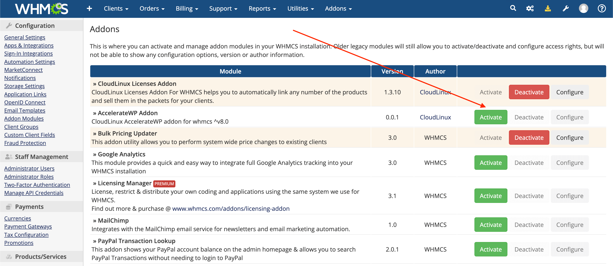
6. Configure addon:
   1. Enable debug mode if necessary. Logs are stored in the "System Module Debug Log"
   2. Allow administrator access to the addon page to view information about the status of the servers
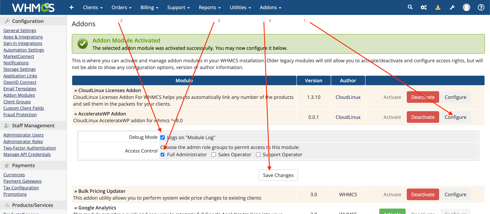

### Setting prices for "Configurable options"

During addon activation, "Configurable options" AccelerateWP are created automatically (System settings/Configurable Option/Group name "AccelerateWP")

:::tip Notes
Don't change the name of the group, options and sub-options!
:::

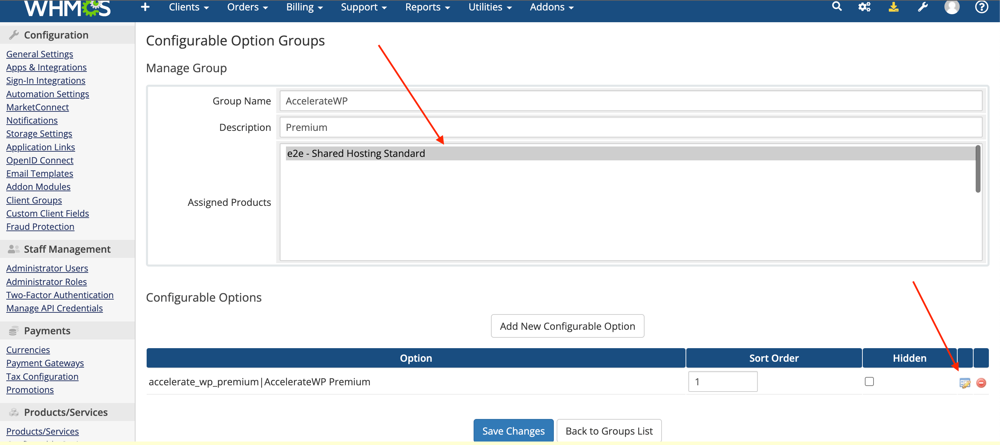

In the AccelerateWP group settings, you need to configure:
* Choose for which products (cPanel/Plesk) you can additionally order the service.
* For the "accelerate_wp_premium|AccelerateWP Premium" option, set the cost.

In the option price settings, there are two options, On and Off. Adjust prices as you see fit.


### Product/Service setup

Set up your service to work with "Configurable options" in the "System settings/Products/Services".

1. Choose the payment type, One time or Recurrent.

2. Make sure the product is associated with the Configurable option "AccelerateWP"
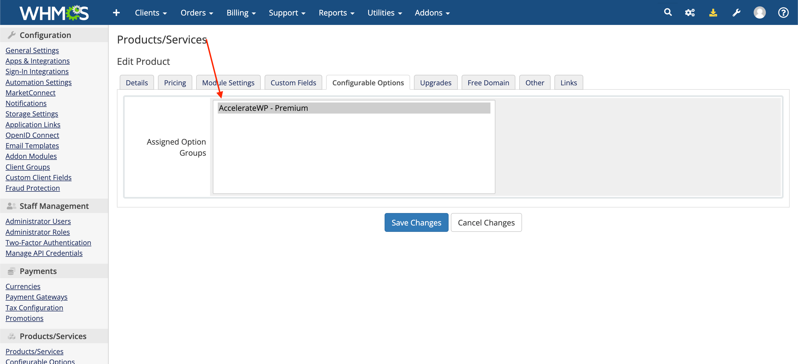
3. Allow clients to upgrade Configurable options so they can purchase AccelerateWP for existing subscriptions.

4. Save changes.
5. Existing customers can upgrade their AccelerateWP Premium settings by changing the order using the "Upgrade/Downgrade options" button.

6. New customers will be able to select AccelerateWP settings during order creation

7. The administrator can manually change the setting of AccelerateWP by editing the purchased service by the customer
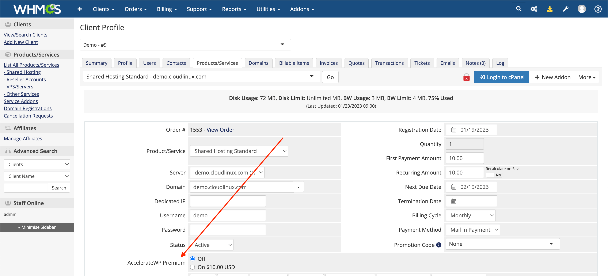

### AccelerateWP Addon page

In case the configurable options "AccelerateWP" were accidentally removed, you can re-install them on the AccelerateWP addon settings page.

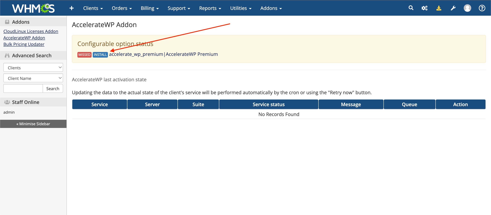

The table shows the queue and history of requests to the servers for which the AccelerateWP status change will be applied.

:::tip Note
Deactivating the addon will delete the table with the history of AccelerateWP activity on the servers.
:::

| Column  | Description                                                                                                                                                                                                                                                                                               |
|---------|-----------------------------------------------------------------------------------------------------------------------------------------------------------------------------------------------------------------------------------------------------------------------------------------------------------|
| Service | What customer service does the zarpos refer to.                                                                                                                                                                                                                                                           |
| Suite   | For which product the status will be changed.<br/>* Last status: previous status<br/> * Current status: current service status<br/>* Will set status: What status will be set. Depending on the selected configurable option "AccelerateWP" and the status of the users's service, the status may differ. |
| Message | The last message about the operation. A detailed error may be displayed.                                                                                                                                                                                                                                  |
| Queue   | Availability of a queue for executing a cron request                                                                                                                                                                                                                                                      |
| Action  | Send request manually                                                                                                                                                                                                                                                                                     |

An example of a request that will be executed by cron
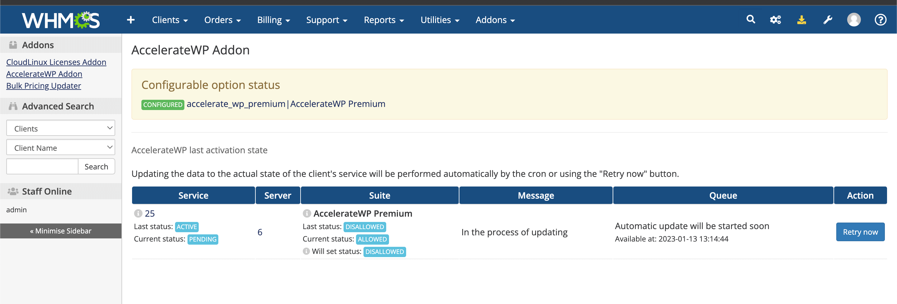

An example of a request that failed
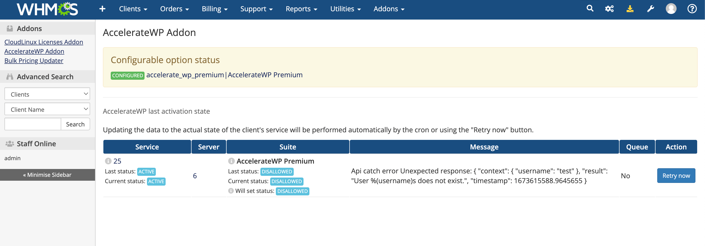

Example of a successful request
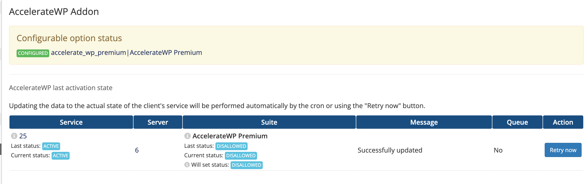

### FAQ

#### How WHMCS communicates with end-server

The addon tracks the change in the order and services of the client.  
For those client services that have the configurable options "AccelerateWP", a request is sent to the server to change the status of AccelerateWP products.

Requests are sent by cron once at the beginning of every minute. If the request fails, there will be a retry after 3 seconds.

Information about the servers to which requests were sent can be viewed on the addon page.

If an error occurs, you will be able to retry the request on the addon page.

The AccelerateWP module enters the "Allowed" status when the client service's status is set to "Active" and the configurable options "On" is selected. In other cases, the status will be set to "Default" and the feature will be turned off for user.

### How to automatically open the "Upgrade/Downgrade Options" page?

Parameters can be used to determine the billing account of the user in order to display proper page.
WHMCS plugin already has automatic redirect to upgrade page, there is only needed to set upgrade-url
to the root of your WHMCS instance.

```
https://your.whmcs.com/?m=acceleratewp&action=provisioning&username=democom&domain=demo.com&server_ip=10.51.0.10
```

| Parameter | Value        | Description                                              |
|-----------|--------------|----------------------------------------------------------|
| m         | acceleratewp | Constant.                                                |
| action    | provisioning | Constant.                                                |
| username  | democom      | Customer's account name.                                 |
| domain    | demo.com     | Customer's account primary domain.                       |
| server_ip | 10.51.0.10   | Primary IP of the server where AccelerateWP is installed |

## Plesk extension

The extension adds the ability to execute the <span class="notranslate">`accelerate-wp-admin set-suite`</span> command to the Plesk XML API.

Do not install it if you are not using AccelerateWP WHMCS billing integration.

:::tip Note
Requires Plesk version 17.0 or higher  
The Plesk extension is available since accelerate-wp-1.3-2 version
:::

### Installation

1. Install

<div class="notranslate">

```
/usr/sbin/plesk bin extension -i /usr/share/cloudlinux/plesk-accelerate-wp-latest.zip
```

</div>

2. Activate

<div class="notranslate">

```
/usr/sbin/plesk bin extension --enable accelerate-wp
```

</div>

### Deinstallation

<div class="notranslate">

```
/usr/sbin/plesk bin extension -u accelerate-wp
```

</div>

## End user workflow

### How to update an existing order (service)

1. Open the services page through the menu "Services - My services"
2. Choose the service you need
   
3. Select the action "Upgrade/Downgrade Options"
   
4. Choose a new configuration and place an order
   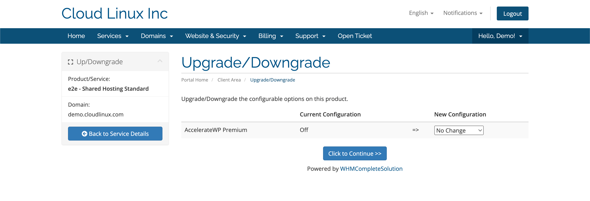
5. Changes will occur automatically after 1 minute or after confirmation of the order by the service provider

### How to checkout new order

1. Select a service in the service provider's WHMCS portal
2. Services with AccelerateWP enabled will display an option to configure AccelerateWP Premium.
   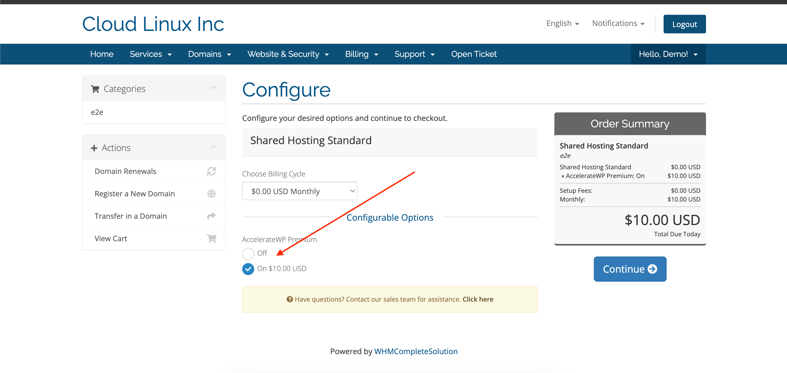
3. Changes will occur automatically after 1 minute or after confirmation of the order by the service provider