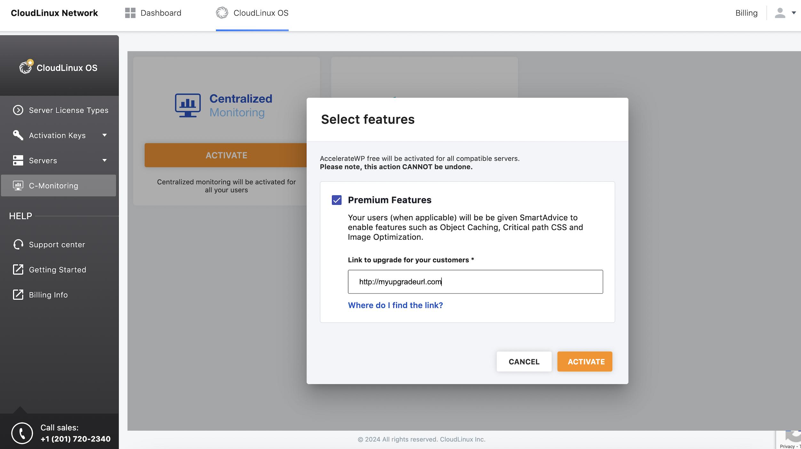

# AccelerateWP

## Getting started

AccelerateWP carries a suite of optimization features that can be enabled and automatically configured for the end user's site.

There are AccelerateWP, AccelerateWP Premium and AccelerateWP CDN feature suites.

AccelerateWP suite is always enabled when AccelerateWP is turned on. Choose whether you want to offer AccelerateWP Premium 
offer AccelerateWP Premium or CDN (Content Delivery Network) for your users (by opting in) and click "Turn on" to start exploring AccelerateWP. 

:::tip Note
AccelerateWP Free suite is enabled by default on all new servers. Proceed to [suites configuration](/shared-pro/accelerate-wp/#suites-usage-statistics) if your server has AccelerateWP already turned on.
:::

#### Activate AccelerateWP for a single server


Enable AccelerateWP Free for all users on the server via [CLI](#enable-acceleratewp-free)

Enable AccelerateWP Premium for all users on the server via [CLI](#enable-acceleratewp-premium)

Once the AccelerateWP suite is enabled by an administrator,
end-users will see an AccelerateWP tab in their control panel interface and be able to activate the optimization feature.

When AccelerateWP CDN suite is enabled by the administrator, end-users will get 1 GB of CDN traffic and be able to activate
the feature to use until the limit is reached. Once the 1GB limit is reached - the end-user will be suggested to extend the CDN limit by
purchasing a CDN plan using [WHMCS or 3'd party billing](#whmcs-billing).

When the AccelerateWP Premium suite is enabled by the administrator, 
end-users will see the Object Caching, Image Optimization and Critical CSS features in their interface, 
but cannot activate the feature unless they purchase the feature using [WHMCS or 3'd party billing](#whmcs-billing).

#### Activate AccelerateWP Free on all servers via Centralized Monitoring

It is possible to activate AccelerateWP Free on all compatible servers via the [Centralized Monitoring UI](https://cm.cloudlinux.com) 
or via the [CLN UI](https://cln.cloudlinux.com/console/cloudlinux/centralized-monitoring). 
Once Activate button is clicked - AccelerateWP Free will be set up automatically on all compatible servers within couple of minutes.


#### Activate AccelerateWP Premium on all servers via Centralized Monitoring

Starting from ```lve-utils-6.5.11-1``` it is possible to activate AccelerateWP Premium via Centralized Monitoring as well.



AccelerateWP Premium will be activated on all compatible servers once activation button is clicked and upgrade url is provided.
Before using AccelerateWP Premium features - all end-users will be requested to upgrade to Premium plan using provided upgrade url. 


#### AccelerateWP suite
This is a basic suite which includes [AccelerateWP base feature](https://user-docs.cloudlinux.com/wpos-plugin/#acceleratewp-feature-wordpress-optimization-plugin): 
a WordPress optimization plugin that provides full page caching, GZIP compression and some other useful optimizations.

**AccelerateWP suite limitations**
* the website must be on an Apache or LiteSpeed web server;
* the website must be on a server with CloudLinuxOS Shared Pro, Solo, or Admin license
* the website must use PHP version 7.3 or higher.
* the WordPress version must be 5.8 and higher.
* no other WordPress Caching plugins must be installed.
* WordPress should not be running in Multisite mode.

#### AccelerateWP Premium suite

This is a premium suite which includes [Object Caching feature](https://user-docs.cloudlinux.com/wpos-plugin/#acceleratewp-premium-object-caching-feature).

The Object Caching mechanism stores database query results in additional storage for quick access. 
This mechanism is beneficial in cases if a website needs to process multiple pages per second as 
requests come in and may be helpful in cases when full-page caching cannot be used, e.g. on personalized pages.

[Image Optimization feature](https://user-docs.cloudlinux.com/wpos-plugin/#image-optimization)

[Critical CSS feature](https://user-docs.cloudlinux.com/wpos-plugin/#css-files)

**Premium suite limitations**

* the website must be on an Apache or a LiteSpeed web server;
* the website must be on a server with CloudLinuxOS Shared Pro, Solo, or Admin license
* the website must use one of the following PHP handlers:
  * [php-fpm](https://blog.cpanel.com/how-to-use-php-fpm-with-cpanel/)
  * [lsapi](/legacy/cloudlinux_os_components/#apache-mod-lsapi-pro)
* the website must use PHP version 7.2 or higher.
* the WordPress version must be 3.7 and higher.
* no other WordPress Caching plugins must be installed.
* the [Snuffleupagus](https://snuffleupagus.readthedocs.io/) must be turned off.
* WordPress should not be running in Multisite mode.

## Administrator interface

#### Overview

:::tip Note
Resellers' users are not allowed to use AccelerateWP features.
:::

In the _CloudLinux Manager → AccelerateWP_ tab an administrator has the opportunity to provide end-users with a suite of features, which on its turn could be activated by end-users.


Once the feature suite is enabled by the administrator, end-users will see an AccelerateWP tab in their control panel interface and be able to activate the optimization feature.

### Suites usage statistics
When AccelerateWP is enabled, the AccelerateWP usage statistics are shown.


It includes:
* `Active Users` block with the total number of users and number of users who have activated the optimization feature/total users
* `Wordpress sites on server` block with a total number of WordPress sites and WordPress sites optimized by the feature
* statistics table

Each row in the statistics table represents a particular user.

The first column `#of Wordpress sites` shows the total number of user's WordPress sites.

The second column `AccelerateWP` shows a number of user's WordPress sites, optimized by the feature.

To enable premium features, click on the "Activate premium features" link and select the options you want. To integrate functions with billing, you must specify the base URL for the purchase of the function by end users.


In case both AccelerateWP and AccelerateWP Premium feature suites are enabled, 
the statistics are extended with AccelerateWP Premium metrics.


Please notice the `AccelerateWP Premium` rows in the `Active Users` and the `Wordpress sites on server` 
blocks, and also the `AccelerateWP Premium` column in the statistics table.

:::tip Note
Newly created users will be accounted for 10 min after adding. 
If you want to get updated statistics immediately, use the "Rescan users websites" button.
:::

### Filters
You may use the following filters to browse AccelerateWP statistics slices.


* `Users with WordPress sites only` filter will show statistics for users who already have WordPress sites; users without WordPress installations will be hidden
* `Users with AccelerateWP only` filter will show statistics for users who utilize the AccelerateWP optimization feature; users who did not activate AccelerateWP feature will be hidden
* `Users with AccelerateWP Premium only` filter will show statistics for users who utilize the AccelerateWP Premium (Object Caching) feature; users who did not activate the AccelerateWP Premium feature will be hidden
* `Users with CDN Free only` filter will show statistics for users who utilize the AccelerateWP CDN feature
* `Users with CDN Pro only` filter will show statistics for users who utilize the AccelerateWP CDN Pro feature


## AccelerateWP CLI

CLI commands for managing AccelerateWP are provided by those utilities:

- `cloudlinux-awp-admin` - for administrator-side actions;
- `cloudlinux-awp-user` - for user-side actions;

[Smart Advice CLI for managing optimization advices](/shared-pro/x-ray/#smart-advice-cli-commands)

Starting from `accelerate-wp-1.6-6` AccelerateWP CLI utilities provide CLI versioning which is defined via `--api-version` option. 

:::tip Note
It is highly recommended to specify CLI version explicitly via --api-version, otherwise CLI will rely on default settings, 
which cannot guarantee backward compatability.
:::

<!----><a name="quick-start-guide-cli"></a>
### Frequently used commands

#### Find all enabled premium users
*Note: this can also be viewed from the **AccelerateWP** tab in CloudLinux Manager*
```
cloudlinux-awp-admin get-stat
```

#### Enable AccelerateWP Free
```
cloudlinux-awp-admin set-suite --suites=accelerate_wp --allowed-for-all
```

:::tip
Free CDN can only be installed based on SmartAdvice. The 1GB free CDN available only if Advice was given to the site. You can try to trace site via X-Ray, then the Advice might appear but it depends on the current rules for CDN Advice. Thus, the SmartAdvice can decide whenther CDN is not needed for some sites, therefore advice will not appear there. If there is no Advice, it means that that site does not need that type of optimization.

SmartAdvice may determine that certain websites don't require CDN resulting in the absence of Advice for you. If no Advice is provided, it indicates that the particular site doesn't necessitate that specific optimization.
:::

#### Enable AccelerateWP Premium
```
cloudlinux-awp-admin set-suite --suites=accelerate_wp_premium --visible-for-all
```

#### Enable AccelerateWP Premium for free for all users:
```
cloudlinux-awp-admin set-suite --suites=accelerate_wp_premium --allowed-for-all
```

#### Set Premium Upgrade URL
```
cloudlinux-awp-admin set-options --upgrade-url "https://plan.upgrade/splash" 
```

#### Enable AccelerateWP CDN free

**All users**
```
cloudlinux-awp-admin set-suite --suites accelerate_wp_cdn --allowed-for-all
```

**Single user or group of users**
```
cloudlinux-awp-admin set-suite --suites=accelerate_wp_cdn --allowed --users=<username1>,<username2>
```

#### Enable AccelerateWP CDN 50GB (example)
*Important note: each of these users will become billable to you as soon as you grant this entitlement*

**All users**
```
cloudlinux-awp-admin set-suite --suites accelerate_wp_cdn_pro --attrs='{"traffic_limit": "50 GB"}' --allowed-for-all
```

**Single user or group of users**
```
cloudlinux-awp-admin set-suite --suites accelerate_wp_cdn_pro --attrs='{"traffic_limit": "50 GB"}' --allowed --users <username>,<username2>
```

#### Revoke access to CDN

**All users**
```
cloudlinux-awp-admin set-suite --suites accelerate_wp_cdn_pro --disallowed-for-all
```

**Single user or group of users**
```
cloudlinux-awp-admin set-suite --suites accelerate_wp_cdn_pro --disallowed --users <username>,<username2>
```

#### Set Upgrade URL for CDN
```
cloudlinux-awp-admin set-options --suite accelerate_wp_cdn_pro --upgrade-url="https://plan.upgrade/cdn-boost"
```

#### Grant users access to ALL premium features
*Note - this is the most common and fundamentally the same as the users upgrading using the WHMCS plugin - you will only be billed for the users that activate at least one premium feature*

**All users**
```
cloudlinux-awp-admin set-suite --suites=accelerate_wp_premium --allowed-for-all
```

**Single user or group of users**
```
cloudlinux-awp-admin set-suite --suites=accelerate_wp_premium --allowed --users=<username1>,<username2>
```

#### Completely disallow access to premium features (including premium SmartAdvice)
**All users**
```
cloudlinux-awp-admin set-suite --suites=accelerate_wp_premium --disallowed-for-all
```

**Single user or group of users**
```
cloudlinux-awp-admin set-suite --suites=accelerate_wp_premium --disallowed --users=<username1>,<username2>
```

#### Enable all features
Use the cloudlinux-awp-admin enable-feature CLI command to ensure the best performance for every WordPress user. This CLI command scans the server for all WordPress sites, then activates the AccelerateWP feature suite. Activation is skipped for any sites with existing page caching or feature incompatibilities.
*Note: Please make sure your AccelerateWP version is >= 1.2-2 before proceeding.*
Scan the server in background mode and activate AccelerateWP on those WordPress sites where it is possible:
```
cloudlinux-awp-admin enable-feature --all
```

#### Check feature activation status
```
cloudlinux-awp-admin enable-feature --status
```


### cloudlinux-awp-admin

```
cloudlinux-awp-admin --api-version <api_version> <command>
```

supported commands for `--api-version 1`:

- `set-suite` - manage optimization suites;
- `set-options` - manage server wide settings;
- `get-report` - get per user information about optimization suites statuses (allowed/disallowed) and usage of specific suites;
- `generate-report` - generate information, that is obtained via `get-report` command;
- `get-stat` - get total information about suites statuses (allowed/disallowed/visible) and usage of optimization features;
- `enable-feature` - activate free AccelerateWP feature to all users on the server;
- `object-cache-banner` - manage Redis Object Cache Pro banner visibility in WordPress (hide or show banner for specific WordPress site);

All CLI responses contain `result` field which says was call successful or not.
- `{"result": "success"}`  - in case of successful call
- `{"result": "ERROR_STRING"}` - in case of unsuccessful call, `result` contains string with error details. 
Response also could have `context` field to provide additional error info, e.g: username, optimization suite or feature, etc.
Example:
```
{
    "context": {
        "suite": "accelerate_wp_cdn"
    },
    "result": "Suite %(suite)s is not visible for users and so cannot be allowed in billing. Activate the suite on server first. Contact your hoster if you don`t have an access to the server.",
    "timestamp": 1691136964.3719108
}
```

#### Manage AccelerateWP optimization suites

`--api-version 1`

supported suites:
- `accelerate_wp` - AccelerateWP Free features;
- `accelerate_wp_premium` - AccelerateWP Premium features;
- `accelerate_wp_cdn` - AccelerateWP CDN 1 GB;
- `accelerate_wp_cdn_pro` - AccelerateWP CDN Pro (50GB by default);

supported actions for specific user(s):
- `--allowed` - make features of optimization suite ALLOWED to be activated by end-user;
- `--disallowed` - make features optimization suite DISALLOWED to be activated by end-user;

```
cloudlinux-awp-admin --api-version 1 set-suite --suites=<suites_comma_separated> --users=<usernames_comma_separated> (--allowed | --disallowed) [--attrs=<json_string>]
```

Examples of CLI commands to disable undesired optimization suite(s) for a single user.

To disable the AccelerateWP suite:
```
cloudlinux-awp-admin --api-version 1 set-suite --suites=accelerate_wp --disallowed --users=<username>
```

To disable the AccelerateWP Premium suite:
```
cloudlinux-awp-admin --api-version 1 set-suite --suites=accelerate_wp_premium --disallowed --users=<username>
```

To disable the AccelerateWP CDN suite:
```
cloudlinux-awp-admin --api-version 1 set-suite --suite=accelerate_wp_cdn --disallowed --users=<username>
```

To disable the AccelerateWP CDN Pro suite:
```
cloudlinux-awp-admin --api-version 1 set-suite --suite=accelerate_wp_cdn_pro --disallowed --users=<username>
```

To enable CDN Pro for a particular user:
```
cloudlinux-awp-admin --api-version 1 set-suite --suites accelerate_wp_cdn_pro --allowed --users=<username>
```

To disable all suites:
```
cloudlinux-awp-admin --api-version 1 set-suite --suites=accelerate_wp,accelerate_wp_premium,accelerate_wp_cdn,accelerate_wp_cdn_pro --disallowed --users=<username>
```

To define CDN traffic limit for AccelerateWP CDN Pro optimization suite (50GB limit is by default):
```
cloudlinux-awp-admin --api-version 1 set-suite --suites accelerate_wp_cdn_pro --allowed --users username1 --attrs='{"traffic_limit": "100 GB"}'
```

supported traffic limits:
- `50 GB` - default traffic limit, if no `--attrs` passed on `set-suite`;
- `100 GB`
- `250 GB`
- `500 GB`
- `1 TB`
- `2.5 TB`
- `5 TB`
- `10 TB`

For *_all_* users on the server:

Supported actions for all users:
- `--allowed-for-all` - make features of optimization suite ALLOWED to be activated for all end-users (and newly created);
- `--disallowed-for-all` - make features optimization suite DISALLOWED to be activated for all end-users (and newly created);
- `--visible-for-all` - make features of optimization suite VISIBLE for all end-users (and newly created);

```
cloudlinux-awp-admin --api-version 1 set-suite --suites=<suites_comma_separated> (--allowed-for-all | --disallowed-for-all | --visible-for-all)
```

Example of command to enable CDN Pro for all users:
```
cloudlinux-awp-admin --api-version 1 set-suite --suites accelerate_wp_cdn_pro --users all --allowed-for-all
```

#### Manage AccelerateWP server wide settings

`cloudlinux-awp-admin --api-version <api_version> set-options`

`--api-version 1`

```
cloudlinux-awp-admin --api-version 1 set-options (--icon-visible=<on/off>) | (--object-cache-banner-visible=<on/off>) | (--suite="feature_suite" --upgrade-url="link_to_url") | (--features="optimization_features_comma_separated" --feature-visible=<on/off>)
```

To make AccelerateWP icon visible or invisible in end-user UI:

```
cloudlinux-awp-admin --api-version 1 set-options --icon-visible=on
```

```
cloudlinux-awp-admin --api-version 1 set-options --icon-visible=off
```

To change the display of promotional materials for all new installations of the Redis Object Cache module by default, 
you need to set the visibility setting

```
cloudlinux-awp-admin --api-version 1 set-options --object-cache-banner-visible=on
```

```
cloudlinux-awp-admin --api-version 1 set-options --object-cache-banner-visible=off
```

To make specific AccelerateWP feature visible or invisible to all users:

:::tip Note
Added in accelerate-wp >= 1.6-6
:::

supported features:
- `critical_css`
- `image_optimization`
- `object_cache`
- `cdn`

```
cloudlinux-awp-admin --api-version 1 set-options --feature-visible=on --features="<features_comma_separated>"
```

```
cloudlinux-awp-admin --api-version 1 set-options --feature-visible=off --features="<features_comma_separated>"
```


To set subscription upgrade url for specific AccelerateWP optimization suite:

for AccelerateWP Premium
```
cloudlinux-awp-admin --api-version 1 set-options --suite accelerate_wp_premium --upgrade-url="http://mybilling1.com"
```

for AccelerateWP CDN Pro
```
cloudlinux-awp-admin --api-version 1 set-options --suite accelerate_wp_cdn_pro --upgrade-url="http://mybilling2.com"
```

#### Generate AccelerateWP suites report for all users on server

`--api-version 1`

```
 cloudlinux-awp-admin --api-version <api_version> generate-report (--all | --status)
```

Start report generation:

```
 cloudlinux-awp-admin --api-version 1 generate-report --all
```

It starts data collection in background, so check status of generation by separate command:

```
 cloudlinux-awp-admin --api-version 1 generate-report --status
```

Rely on `scan_status` key to ensure scanning is over, for example if it is still in progress:
```
 {
    "last_scan_time": 1690198116,
    "result": "success",
    "scan_status": "in_progress",
    "timestamp": 1690199148.6370175,
    "total_users_scanned": 0,
    "total_users_to_scan": 1
}
```

#### AccelerateWP suites statistics

`--api-version 1`

```
cloudlinux-awp-admin --api-version <api_version> get-report (--all | --users=<usernames_comma_separated>)
```

Get suites statistics for all users:
```
cloudlinux-awp-admin --api-version 1 get-report --all
```

or for a particular user:
```
cloudlinux-awp-admin --api-version 1 get-report --users=<username>
```

This CLI command returns the following information:
* total number of users in the report -- `total_users_count`
* total number of websites in the report -- `total_wordpress_count`
* total number of users with particular suite enabled -- `total_users_count_active`
* total number of websites with particular suite enabled -- `total_sites_count_active`
* number of websites with a particular suite enabled per each user in the report -- `*_sites_count` in the `users` list
* suites visibility status per each user in the report -- `suites` in the `users` list
  * possible values for visibility status are: `visible`, `allowed`, `disabled`

The example output for a single user is given below:

```
{
    "last_scan_time": 1681198804,
    "result": "success",
    "timestamp": 1681203383.3503218,
    "total_sites_count_active": {
        "accelerate_wp": 1,
        "accelerate_wp_premium": 0
    },
    "total_users_count": 1,
    "total_users_count_active": {
        "accelerate_wp": 1,
        "accelerate_wp_premium": 0
    },
    "total_wordpress_count": 2,
    "users": [
        {
            "accelerate_wp_active_sites_count": 1,
            "accelerate_wp_premium_sites_count": 0,
            "suites": {
                "accelerate_wp": {
                    "source": "manual",
                    "status": "allowed"
                },
                "accelerate_wp_premium": {
                    "source": "default",
                    "status": "visible"
                }
            },
            "username": "user16",
            "wp_sites_count": 2
        }
    ]
}
```

#### AccelerateWP features statistics

Get overall AccelerateWP features usage statistics for a server with:

`--api-version 1`

```
cloudlinux-awp-admin --api-version 1 get-stat
```

This CLI command returns the following information:
* number of `allowed_users` in `total` and per feature
* number of `visible_users` in `total` and per feature
* number of `allowed_suites` per suite
* number of sites with enabled features in `total` and per feature -- `enabled_sites`
* number of users with visible features in `total` and per feature -- `visible_users`
* features which are currently allowed -- `features_allowed_by_default`
* features which are currently visible -- `features_visible_by_default`

The example output is given below:

```
{
    "accelerate_wp_suite_enabled_premium_suite_disallowed": 0,
    "accelerate_wp_suite_enabled_premium_suite_visible": 0,
    "allowed_suites": {
        "accelerate_wp": 1,
        "accelerate_wp_cdn_free": 1,
        "accelerate_wp_cdn_pro": 0,
        "accelerate_wp_premium": 1
    },
    "allowed_users": {
        "cdn_free": 1,
        "cdn_pro": 0,
        "critical_css": 1,
        "image_optimization": 1,
        "object_cache": 1,
        "site_optimization": 1,
        "total": 1
    },
    "enabled_sites": {
        "cdn_free": 0,
        "cdn_pro": 0,
        "critical_css": 1,
        "image_optimization": 0,
        "object_cache": 0,
        "site_optimization": 0,
        "total": 1
    },
    "enabled_suites": {
        "accelerate_wp": 0,
        "accelerate_wp_cdn_free": 0,
        "accelerate_wp_cdn_pro": 0,
        "accelerate_wp_premium": 1
    },
    "enabled_users": {
        "cdn_free": 0,
        "cdn_pro": 0,
        "critical_css": 1,
        "image_optimization": 0,
        "object_cache": 0,
        "site_optimization": 0
    },
    "features_allowed_by_default": [
        "cdn",
        "critical_css",
        "image_optimization",
        "object_cache",
        "site_optimization"
    ],
    "features_visible_by_default": [
        "cdn",
        "critical_css",
        "image_optimization",
        "object_cache",
        "site_optimization"
    ],
    "is_accelerate_wp_flag_enabled": false,
    "is_accelerate_wp_icon_enabled": true,
    "result": "success",
    "timestamp": 1690979440.5282295,
    "upgrade_urls": {
        "accelerate_wp_cdn_pro": null,
        "accelerate_wp_premium": null
    },
    "visible_users": {
        "cdn_free": 1,
        "cdn_pro": 0,
        "critical_css": 1,
        "image_optimization": 1,
        "object_cache": 1,
        "site_optimization": 1,
        "total": 1
    }
}

```

#### Activate free AccelerateWP for all WordPress sites on the server
`--api-version 1`:

```
cloudlinux-awp-admin --api-version 1 enable-feature (--all | --status)
```

Use the that command to ensure the best performance for every end-user. CLI command
scans a server for all WordPress sites and activates the AccelerateWP
free feature suite. It can take up to 2 minutes for a single site. 
CLI command skips activation for WordPress sites with page caching or feature incompatibilities.

:::tip Note
Please make sure your AccelerateWP version is >= 1.2-2 before proceeding.
:::

Scan the server in background mode and activate free AccelerateWP plugin
on those WordPress sites where it is possible:
```
cloudlinux-awp-admin --api-version 1 enable-feature --all
```
The output will state the number of users for the scan and the
progress state of the process.

Check activation status:
```
cloudlinux-awp-admin --api-version 1 enable-feature --status
```
The output will be either:
* Activation is still in progress,
* Activation is done. The message will state how many users
were initially for the scan, a number of WordPress sites with
successfully activated suite and the total number of WordPress sites
scanned.

#### AccelerateWP disable Redis Object Cache Pro banner

`--api-version 1`

```
cloudlinux-awp-admin --api-version 1 object-cache-banner (--enable | --disable) (--all | --users=<usernames_comma_separated>)
```

Depending on the server settings, the `WP_REDIS_DISABLE_BANNERS` constant will be defined in the `wp-config.php` 
file when the module is activated, which affects the display of promotional materials.

To change the `WP_REDIS_DISABLE_BANNERS` constant for previously installed modules, you need to run a process to update the constant:

Hide on websites where the module is installed
- for all users:  
  ```cloudlinux-awp-admin --api-version 1 object-cache-banner --all --disable```
- for specific users (users separated by commas):  
  ```cloudlinux-awp-admin --api-version 1 object-cache-banner --users foo,bar --disable```
- for current user (run under the user):  
  ```cloudlinux-awp-user --api-version 1 object-cache-banner --all --disable```
- for a specific website (run under the user):  
  ```cloudlinux-awp-user --api-version 1 object-cache-banner --wp-path "" --domain "demo.com" --disable```

Display on websites where the module is installed
- for all users:  
  ```cloudlinux-awp-admin --api-version 1 object-cache-banner --all --enable```
- for specific users (users separated by commas):  
  ```cloudlinux-awp-admin --api-version 1 object-cache-banner --users foo,bar --enable```
- for current user (run under the user):  
  ```cloudlinux-awp-user --api-version 1 object-cache-banner --all --enable```
- for a specific website (run under the user):  
  ```cloudlinux-awp-user --api-version 1 object-cache-banner --wp-path "" --domain "demo.com" --enable```

If the banner was previously disabled/enabled for the user/website, 
then for its subsequent activation of the ObjectCache module, the general settings at the server level will be applied. 
This means that for each user/website we do not store an individual banner disable/enable setting.


#### SmartAdvice email reminders

This section outlines the process of managing email notifications from the SmartAdvice plugins. It applies to all users and it is a global (server-wide) setting.  

_Sending reminder notifications for not activated advices once a month:_  
```
cloudlinux-awp-admin --api-version 1 set-options --smart-advice-reminders=<on/off>
```
  

### cloudlinux-awp-user

```
cloudlinux-awp-user --api-version=<api_version> <command>
```

supported commands:
- `enable` - activate specific optimization feature on WordPress site;
- `disable` - deactivate specific optimization feature on WordPress site;
- `get` - get information of optimization features on all user`s WordPress sites;

Use the following CLI command **_on behalf of a user_**

All CLI responses contain `result` field which says was call successful or not.
- `{"result": "success"}`  - in case of successful call
- `{"result": "ERROR_STRING"}` - in case of unsuccessful call, `result` contains string with error details

#### Enable optimization feature

`--api-version 1`

supported features:

- `accelerate_wp`
- `object_cache`
- `critical_css`
- `image_optimization`

```
cloudlinux-awp-user --api-version 1 enable --feature <feature> --wp-path <path_to_wordpress> --domain <user_domain> [--ignore-errors]
```

Use `--ignore-errors` to ignore WordPress site web-checks after enabling optimization features.

example of enabling Object Caching feature
```
cloudlinux-awp-user --api-version 1 enable --feature object_cache --wp-path "userwordpresssite" --domain username1.com
```

Please, make sure `--wp-path` is same as in `"path"` key of `cloudlinux-awp-user get` json output.

Successful response example of enabling feature:
rely on `feature.enabled` field to identify that feature was enabled
```
{
    "feature": {
        "enabled": true
    },
    "result": "success",
    "timestamp": 1690975273.8860605
}
```

#### Disable optimization feature

`--api-version 1`

supported features:

- `accelerate_wp`
- `object_cache`
- `critical_css`
- `image_optimization`

```
cloudlinux-awp-user --api-version 1 disable --feature <feature> --wp-path <path_to_wordpress> --domain <user_domain>
```

example of disabling Object Caching feature
```
cloudlinux-awp-user --api-version 1 disable --feature object_cache --wp-path "userwordpresssite" --domain username1.com
```

Please, make sure `--wp-path` is same as in `"path"` key of `cloudlinux-awp-user get` json output.


Successful response example of enabling feature:
rely on `feature.enabled` field to identify that feature was enabled
```
{
    "feature": {
        "enabled": true,
        "visible": true
    },
    "result": "success",
    "timestamp": 1690975273.8860605
}
```

#### AccelerateWP features detailed statistics

`--api-version 1`

```
cloudlinux-awp-user --api-version 1 get
```

The command reports:
* features allowed for a user -- `allowed_features`
* all user's websites `docroots` with features information per each `wps`, which includes:
  * status of each feature -- if the feature is `enabled`, if the feature is `visible`
  * issues detected (if any) for each feature
* subscription status (for premium features) -- `subscription`
* features visible for a user -- `visible_features`

The example output is given below:

```
{
    "allowed_features": {
        "accelerate_wp": [],
        "accelerate_wp_premium": []
    },
    "docroots": [
        {
            "domains": [
                "user0.com"
            ],
            "php_handler": "fastcgi",
            "php_version": "plesk-php73-fastcgi",
            "wps": [
                {
                    "features": {
                        "accelerate_wp": {
                            "enabled": false,
                            "issues": [
                                {
                                    "context": {
                                        "plugins": "WP Rocket"
                                    },
                                    "description": "Found conflicting plugins: %(plugins)s.",
                                    "fix_tip": "Deactivate and uninstall the conflicting plugin using the WordPress administration interface.",
                                    "header": "Conflicting plugins are enabled",
                                    "type": "incompatibility"
                                }
                            ],
                            "visible": true
                        },
                        "object_cache": {
                            "enabled": false,
                            "issues": [
                                {
                                    "context": {
                                        "blog_url": "https://blog.cloudlinux.com/",
                                        "supported_handlers": "php-fpm, lsapi"
                                    },
                                    "description": "Website uses unsupported PHP handler. Currently supported handler(s): %(supported_handlers)s.",
                                    "fix_tip": "Please, set or ask your system administrator to set one of the supported PHP handlers for the domain: %(supported_handlers)s. Or keep watching our blog: %(blog_url)s for supported handlers list updates.",
                                    "header": "Unsupported PHP handler",
                                    "type": "incompatibility"
                                }
                            ],
                            "visible": true
                        }
                    },
                    "path": "wordpress",
                    "version": "6.2"
                }
            ]
        },
        {
            "domains": [
                "sub.user0.com"
            ],
            "php_handler": "fastcgi",
            "php_version": "plesk-php73-fastcgi",
            "wps": []
        }
    ],
    "max_cache_memory": "64mb",
    "result": "success",
    "subscription": {
        "object_cache": "no"
    },
    "timestamp": 1681200081.765476,
    "upgrade_url": null,
    "used_memory": null,
    "visible_features": {
        "accelerate_wp": [
            "accelerate_wp"
        ],
        "accelerate_wp_premium": [
            "object_cache"
        ]
    }
}
```

## Configure redis extension for alt-php

Object cache optimization feature requires several php extensions to be enabled, so there is a script 
`/usr/share/cloudlinux/wpos/enable_redis_for_alt_php.py` which does configuration of
required modules: `redis`, `igbinary`, `json`.

By default, it modifies global php.ini and enables required extensions there.

Starting from `accelerate-wp >= 1.6-7` - to prevent this script of modifying 
global php.ini - create marker file: `/var/clwpos/admin/do_not_modify_global_php.flag`.
In that case, additional custom php ini with required php extension will be created and global php.ini remains unmodified.

## Billing Integration (upsell automation for premium features)
The premium features of AccelerateWP are intended to generate revenue for CloudLinux hosting customers by adding high-end performance value to WordPress that meets or exceeds the value of premium WordPress Hosting/Managed WordPress market leaders. AccelerateWP premium features are suggested to hosting end-users (and WordPress administrators) when substantial data supports a significant performance boost will be achived upon activation. 

### Setting the upgrade URL
When a premium feature is suggested to the user/admin through our SmartAdvice utility, they will be prompted to upgrade. The upgrade URL is where the user will be sent when they click "upgrade" and this is customizable per server (or fleet). There are 2 common upgrade packaging models that will dictate how this URL is set and you will need to make this decision and configure the upgrade URL before offering AccelerateWP premium. The 2 packaging models are:
1. Include AccelerateWP Premium features in your highest tier hosting plans
2. Offer as an add-on subscription to existing hosting plans

Once you have made this decision, you will need to integrate your billing platform.

### WHMCS billing

If you use WHMCS, AccelerateWP Premium billing integration is quite simple. CloudLinux developed its own WHMCS plugin which provides this out of the box. 
View our [documentation](/cln/whmcs_advantage/) to learn how to install and use the plugin.

### Other billing integration

As AccelerateWP Premium is a feature that works on a subscription basis, we made it possible for hosters to integrate their existing billing systems with our plugin and sell the 
feature for their users.

When AccelerateWP Premium is enabled in the admin interface, users get a proposal to upgrade their subscription.


When a user upgrades the subscription to the plan with AccelerateWP support, billing must execute the following command on the server:
```
cloudlinux-awp-admin set-suite --suites=accelerate_wp_premium --allowed --source=BILLING_OVERRIDE --users=<username>
```

This command makes two things:
- allow the user to install the plugin, bypassing the upgrade window;
- reports premium as being used to CLN, starting the billing cycle for the hoster.


When the user terminates or downgrades the plan, the following command must be executed by the billing system:
```
cloudlinux-awp-admin set-suite --suites=accelerate_wp_premium --default --source=BILLING_OVERRIDE --users=<username>
```

## Setup upgrade URL for AccelerateWP Premium

The upgrade window can be customized with a link to the plan upgrade page, which can be set using the CLI command:

```
cloudlinux-awp-admin set-options --upgrade-url https://plan.upgrade/splash
```


AccelerateWP automatically appends GET parameters when the link is displayed.

```
https://plan.upgrade/splash/?m=acceleratewp&action=provisioning&username=democom&domain=demo.com&server_ip=10.51.0.10
```

| Parameter | Value        | Description                                              |
|-----------|--------------|----------------------------------------------------------|
| m         | acceleratewp | Constant.                                                |
| action    | provisioning | Constant.                                                |
| username  | democom      | Customer's account name.                                 |
| domain    | demo.com     | Customer's account primary domain.                       |
| server_ip | 10.51.0.10   | Primary IP of the server where AccelerateWP is installed |

Parameters can be used to determine the billing account of the user in order to display the proper page. 
WHMCS plugin already has an automatic redirect to the upgrade page, there is only needed to set upgrade-url 
to the root of your WHMCS instance.

```
cloudlinux-awp-admin set-options --upgrade-url https://whmcs.mydomain.zone/
```

Upgrade URL is opened in a modal browser window and will be automatically closed
when AccelerateWP receives a callback about the successful upgrade.

The callback is already implemented in the WHMCS plugin, but if you are using some other billing,
you should add the following code on the page which appears when a user successfully upgrades the subscription.

    <script>
    if(window.opener && !window.opener.closed) {
        window.opener.postMessage('PAYMENT_SUCCESS', '*');
    }
    </script>


In order to remove the link, just set the upgrade URL to the empty one.

```
cloudlinux-awp-admin set-options --upgrade-url ''
```

## Disable AccelerateWP Premium

If you would like to stop using AccelerateWP Premium, 
click on the `manage` link and remove the `Premium Features` checkbox.
AccelerateWP will be still available for your users.


## Disable AccelerateWP

If you would like to stop using AccelerateWP completely, toggle the `AccelerateWP` back.
Both AccelerateWP and AccelerateWP Premium will be turned off.


This operation will:
* disable the AccelerateWP tab in the users' control panel interface
* disable all AccelerateWP optimization suites
* deactivate all optimization features for all users

This operation will NOT:
* cancel the subscription made by the user in WHMCS or other billing. The user's subscription stays 
  alive and the user will still be charged in the billing system unless the hoster manually makes a refund


## Logs
The main AccelerateWP log is located at
* `/var/log/clwpos/main.log`


In case AccelerateWP Premium is active, the auxiliary monitoring daemon `clwpos_monitoring` is also activated. Its log is located at
* `/var/log/clwpos/daemon.log`


## FAQ

### With which panel can I use AccelerateWP?

AccelerateWP is compatible with cPanel, Plesk, and DirectAdmin, and it also [supports custom control panel integration](https://blog.cloudlinux.com/acceleratewp-is-now-supporting-custom-control-panel-integration).


### Is it possible to use AccelerateWP on a non-control panel server?

Yes, if a custom integration mechanism is used: [custom control panel integration](https://blog.cloudlinux.com/acceleratewp-is-now-supporting-custom-control-panel-integration).

### Do you plan to enable support of the Nginx server?

This is a part of our very long-term plans, thus not expected in the nearest future.

### How will it help my customers?

AccelerateWP is a complex solution to help your customers increase their WordPress site performance. AccelerateWP brings number of optimization features, like object caching, css and js preprocessing and website preloading.

### How could I monitor Redis instances while using the AccelerateWP Premium suite?

The Redis process is started for a user after activating the AccelerateWP Premium Object Caching feature for at least one WordPress site.
It is killed after AccelerateWP Premium Object Caching has been deactivated for all user's websites.

Look through the processes list to check the Redis status for a particular user:
```
 ps aux | grep redis  

 awpuser  2662517  0.0  0.5 101096  8512 ?        Sl   15:33   0:00 /opt/alt/redis/bin/redis-server unixsocket:/home/awpuser/.clwpos/redis.sock
```
In case if AccelerateWP Premium is active, the auxiliary monitoring daemon `clwpos_monitoring` is also activated. It checks Redis instances each 5 minutes, starts new instances, restart failed ones and kills the “garbage” instances if needed.
Check daemon status using `service clwpos_monitoring status` and its main log: `/var/log/clwpos/daemon.log`.

## My users are complaining that their features are not installed automatically after a subscription upgrade
This can be caused by several reasons. Either your customer's website was detected to be malfunctioning
or there was an issue with the environment when the feature was installed 
(e.g. bad internet connectivity with the WordPress market).

First, try to enable the feature manually using the AccelerateWP interface. 
Most likely you will find a human-readable error message there.

Next, you can try to dive into `/var/log/clwpos/daemon.log` and find the reason why the `enable` command failed.
Here is an example of a successful feature installation for reference:


    2023-02-14 11:01:14,696: (clwpos.daemon_base) [INFO] Running cloudlinux-awp-user enable --feature object_cache --domain wpujj.com --wp-path
    2023-02-14 11:01:15,081: (clwpos.daemon_base) [INFO] Command succeded with output:
    `CompletedProcess(args=['/bin/cagefs_enter.proxied', 'cloudlinux-awp-user', 'enable', '--feature', 'object_cache', '--domain', 'wpujj.com', '--wp-path', ''], returncode=0, 
    stdout='{\n "context": {\n "domain": "wpujj.com",\n "feature": "object_cache"\n  },\n  "result": "success",\n "timestamp": 1676372475.044419,\n \n}\n', stderr='')`
    2023-02-14 11:01:15,086: (clwpos.daemon_base) [INFO] background process finished: pid=415368

Also, some useful notes may be present in the user's log located at `/home/<username>/.clwpos/main.log`.

If the issue persists, or you cannot resolve it yourself, 
contact CloudLinux support and attach `/var/log/clwpos/daemon.log` and `/home/<username>/.clwpos/main.log` 
for further investigation.


## Troubleshooting

### End-users of AccelerateWP Premium feature encounter Redis extension is not installed for selected php version
In order to make use of the AccelerateWP Premium Object Caching feature, the loaded Redis extension is required for the end-user's website.
End-users will not be able to activate the Object Caching feature until the Redis extension configuration is incomplete.

Corresponding incompatibility warning will be displayed in the control panel's User interface:


The Redis extensions are configured for all installed and supported PHP versions automatically:
* right after the AccelerateWP Premium suite is enabled
* by cron once a day

or you can trigger the utility manually:
```
/usr/sbin/enable_redis_for_panel_php
```

All errors will be displayed in standard output and logged into `/var/log/clwpos/main.log`.


**Ensuring the EA-PHP Redis extension is configured correctly**

1. Check Redis extension package is installed by running the following command

    ```
    rpm -q ea-phpXY-php-redis
    ```
    Install the corresponding extension if it is not present:
    ```
    yum install ea-phpXY-php-redis
    ```
    Consider the example for checking out and installing the Redis extension for `ea-php74`: 
    ```
    rpm -q ea-php74-php-redis
    yum install ea-php74-php-redis
    ```
2. Check Redis `ini` file is present by running the following command:
    ```
    ls /opt/cpanel/ea-phpXY/root/etc/php.d/ | grep 50-redis
    ```
    Consider the example for checking out Redis extension for `ea-php74`: 
    ```
    ls /opt/cpanel/ea-php74/root/etc/php.d/ | grep 50-redis
    ```
    Try reinstalling the package if `ini` file is missing.
3. Make sure the Redis module is loaded under a specific user by running the following command:
    ```
    su -c "php -m | grep redis" <username>
    ```


**Ensuring the ALT-PHP Redis extension is configured correctly**

1. Check if `redis.so` is present for a particular alt-php version:
    ```
    ls /opt/alt/phpXY/usr/lib64/php/modules | grep redis.so
    ```
    Consider the example for checking alt-php74 redis.so:
    ```
    ls /opt/alt/php74/usr/lib64/php/modules | grep redis.so
    redis.so
    ```
2. If the Redis module is missing:
   
   a. Install the `alt-phpXY-pecl-ext` package manually
   b. Run the Redis configuration script `/usr/share/cloudlinux/wpos/enable_redis_for_alt_php.py`
      
   All errors will be displayed in standard output and logged into `/var/log/clwpos/main.log`.
3. If the Redis module is present for a particular php version, but the incompatibility issue persists, re-check the following:
    
    a. Make sure the Redis module is loaded under user:
    ```
    su -c "php -m | grep redis" <username>
    ```
    b. Check the required extensions are enabled in `php.ini`:
    ```
    cat /opt/alt/phpXY/etc/php.ini | grep redis.so
    cat /opt/alt/phpXY/etc/php.ini | grep json.so
    cat /opt/alt/phpXY/etc/php.ini | grep igbinary.so
    ```
    
    c. Enable missing extensions manually.


### End-users of AccelerateWP encounter PHP-related issues during feature activation
End-users may encounter PHP-related errors while activating the AccelerateWP features.


The general examples of possible reasons are:
* broken PHP binaries
* missing PHP files
* etc.

To check that this issue is caused by PHP itself, call any PHP command, for example:
```
/opt/cpanel/ea-php80/root/usr/bin/php -i
```
And make sure that installed `ea-php80` packages are not broken using
`rpm -V <package_name>`.

Reinstall broken packages if found.

Consider the example issue (presented at the picture above) with broken `mbstring.so` for `ea-php80`:
```
/opt/cpanel/ea-php80/root/usr/bin/php -i
Segmentation fault (core dumped)  

rpm -V ea-php80 

rpm -V ea-php80-php-mbstring
S.5....T.    /opt/cpanel/ea-php80/root/usr/lib64/php/modules/mbstring.so
......G..  a /usr/lib/.build-id/9c/38ed78a6d401ff6dce059ccea51c95870d98c5  

yum reinstall ea-php80-php-mbstring
```
