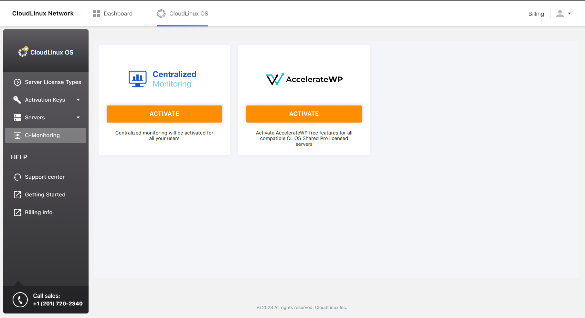

# Centralized Monitoring

## Description

<span class="notranslate">Centralized Monitoring</span> is a tool that allows hosting administrators to monitor load for all their servers and users.

<span class="notranslate">Centralized Monitoring</span> allows you to:

* View system metrics for all clients’ end servers
* View the LVE statistics per user for all clients’ end servers
* Enable AccelerateWP Free on all compatible servers

## Installation

:::tip Note
Make sure that `cm.cloudlinux.com` is available on your end server.
:::

1. Make sure you have a CloudLinux OS Shared Pro subscription.
2. Make sure you have installed the latest **lve-utils** package. You can install or update it with the following commands:
    * installation
    ```
    yum install lve-utils
    ```
    * update
    ```
    yum update lve-utils
    ```
3. Log in to the [https://cm.cloudlinux.com/](https://cm.cloudlinux.com/) using CLN credentials (if you are already logged in via CLN, authorization via CM is not necessary, it uses SSO).
4. Activate statistics collection on all your servers via the [Centralized Monitoring UI](https://cm.cloudlinux.com) or via the [CLN UI](https://cln.cloudlinux.com/console/cloudlinux/centralized-monitoring). Optionally, activate the [AccelerateWP Free](/shared-pro/accelerate-wp/#acceleratewp-suite)* for all of your compatible servers.
     Additionally, it is possible to activate the [AccelerateWP Premium](/shared-pro/accelerate-wp/#acceleratewp-premium-suite)* for all compatible servers.
    
5. Within couple minutes after the activation, statistics collection and sending to the central server, [AccelerateWP Free](/shared-pro/accelerate-wp/#acceleratewp-suite)* and [AccelerateWP Premium](/shared-pro/accelerate-wp/#acceleratewp-premium-suite) * will be set up automatically: all required packages and components will be installed. For new, just registered servers, actions can take up to 5 hours.
6. Make sure you have activated statistics collection (see paragraph 4) otherwise you will not be able to set up your servers. For instant set up of a registered server after statistics collection was enabled, run the following commands for all servers:
    ```
    # rhn_check	
    # /usr/share/cloudlinux/cl_plus/manage_clplus enable
    ```
    **Note**: If the `rhn_check` command is not found, run the following command:
    ```
    # yum install/update rhn-check rhn-setup
    ```
   AccelerateWP Premium activation support was added in ```lve-utils-6.5.11-1```.
7. After 5 hours (or after the manual setup), check that statistics for all registered servers is collected via [https://cm.cloudlinux.com/#/servers](https://cm.cloudlinux.com/#/servers). And check that user statistics on the servers is collected via [https://cm.cloudlinux.com/#/users](https://cm.cloudlinux.com/#/users).
    :::tip Note
    User statistics will be available only for users that were loaded starting from connecting the server to the Centralized Monitoring.
    :::


\* AccelerateWP Free activation also automatically installs and configures 
[Autotracing](/shared/command-line_tools/#x-ray-autotracing) on server.


## Centralized Monitoring: mode without session expired

Users can monitor server’s or user’s load for a long time using the mode without session expired.

To turn on the mode without session expired, follow the next steps:

1. Log in to the [cln.cloudlinux.com](https://cln.cloudlinux.com/console/) via your account
2. Open the [cm.cloudlinux.com](https://cm.cloudlinux.com/#/servers) in a new browser tab/window (please, use the same browser as in step 1)
3. Use the toggle to turn on/off 10 min auto logout

    

Your session in the [cln.cloudlinux.com](https://cln.cloudlinux.com/console/) will expire in 10 min. But your session in the [cm.cloudlinux.com](https://cm.cloudlinux.com/#/servers) will not expire while your browser tab remains open.


## Centralized Monitoring user interface


You can access <span class="notranslate">Centralized Monitoring</span> in your [CLN account](https://cln.cloudlinux.com/).
Click <span class="notranslate">C-Monitoring</span> in the left menu.


### Servers


This page contains the list of all clients’ end servers. The server appears in the list after finishing [Installation](./#installation-2). By default, there is a descending sort by CPU usage.


The following values are available for each server:

* <span class="notranslate">**Load Avg 15m**</span> – average system load for the last 15 min
* <span class="notranslate">**CPU Usage**</span> – CPU usage for the last 15 min (the number of cores can be found in the hint)
* <span class="notranslate">**Memory Usage**</span> – free available memory, the second value is the total memory for the last 15 min
* <span class="notranslate">**IO read/write**</span> – disk read bytes/disk written bytes for the last 15 min

:::tip Note
The values are calculated using a 15 min time period but the metric state is updated automatically every minute by default or you can choose from one of the predefined periods.
:::

* <span class="notranslate">**Idle state**</span> – there were no statistics for the server for the last minute. 
* <span class="notranslate">**N/A state**</span> – there were no statistics for the server for the last 30 days. This can happen if a new server was added but statistics sending was not configured.

There is no pagination on the <span class="notranslate">_All servers_</span> page and all columns can be sorted by absolute value.
Use the search tool to operate with the data.

### Servers details

To get the detailed statistics for the server via charts, click a desired server line in the table.
All charts are auto-refreshed and there is an ability to select the period for metrics data to be updated for the chart.


:::warning Note
We store the metrics data for one month only.
:::

### Charts for server metrics

### Visualization of the most popular server states


### Disk space usage


### Open file descriptor/Context switches


### System load 1m , 5m, 15m


### CPU usage (total, system, user, iowait, steal)


### Network traffic usage


### Disk space usage


### Memory usage (total, used, available)


### Time spent doing I/Os


### Disk IOps Completed


### Disk read/write data


### Disk read/write time


### Apache connections (number)/Number of requests per minute/Max connections


:::warning Note
In the current version, we collect these metrics for the cPanel end servers only. We are planning to add other panels support soon.
:::

:::warning Note
In the current version, we collect these metrics only for Apache (NOT for LiteSpeed, Nginx, etc.). The charts will be empty for LiteSpeed, Nginx, etc..
:::

### MySQL queries


MySQL queries collector gets number of queries executed on the server per minute. It takes data from the MySQL server variable "Questions". You may manually check variable value by executing query `SHOW GLOBAL STATUS LIKE 'Questions';`. For more information about MySQL server variables - please, see MySQL documentation.

### The most loaded server users for the last minute


We calculate the user’s load by LVE statistics that we collect on the end server.
The idle state for the user means that the LVE statistics were not collected for the last minute for some reason.

In each cell there are current usage/limit values for the basic LVE limits:

* CPU Usage
* Entry Processes
* Physical Memory Usage
* IOPS
* IO Usage
* Number of Processes
* MySQL CPU
* MySQL IO

In the hint, there is a number of faults for each limit. The values in the columns are underlined (it is red if load-to-limit ratio >=90%  and it is yellow if load-to-limit ratio >= 50%). For the current implementation, the only sort by the load-to-limit ratio is available.
By default, there is a descending sort by the CPU usage column.

When sorting by a column, the lines with the load-to-limit ratio >=90% for this column will have the red background color, and lines with the load-to-limit ratio >=50% for this column will have the yellow background color.

:::tip Note
The users with unlimited resources (∞) will be at the bottom of the table. 
:::

### Users

This page contains all users for the all server of the client and their LVE statistics for the last minute. You can select the number of users on this page and search by user’s data.

The description of this page is the same as [*The most loaded server users for the last minute*](./#the-most-loaded-server-users-for-the-last-minute) of the top 5 loaded users.


User’s metrics data can be sorted by the load-to-limit ratio and by the absolute value.

The absolute value is used to analyse the load produced by unlimited users.

The value of the load-to-limit ratio is convenient to use in the analysis of how many resources the users consume and whether they need to change the limits.

The values like this  means that the resource is unlimited and 500.2 MB is the current usage of it.

Metrics data of _Idle users_ is not used in the sorting, so such users always will be at the end of the list.  The sorting can be done for only one metric.

### Charts for Users metrics 

:::warning Note
We store the metrics data for one month only.
:::

On the user details page, the admin can find the charts for all LVE limits.


## Alert Manager

Alert Manager allows you to create a server or user alert for selected metrics and email the triggered events.

### Alert Manager page


The Alert Manager page contains a table with the following:

* **Alert name** - a unique alert name
* **Tracking metric** - a name of a server/user metric which will trigger the alert notification
* **# of servers** - number of servers on which the metric will be tracked
  * click  to view a list of servers host names
* **# of users** - number of users for which the metric will be tracked
  * click  to view a list of users names
* **Value** - a condition for the alert rule which will be applied to the tracking metrics
* **Email** - email to send the triggered events notifications
* **Type** - a type of the alert rule
* **# of triggered events** - the number of events from the time, when alert rule was created
  *  the event is still firing
* **Time  of the last trigger** - the time of last triggered event, it is the time in your browser time zone
* **Actions** - click  to edit and  to delete the alert rule

**Color Codes**

* **Red** color means that the event with the condition "more than" is still firing.
* **Green** color means that the event with the condition "less than" is still firing.

### Creating an alert

To create a new alert, click the _Create alert_ button.


Next, fill out the opened popup.


* **Name of alert** - a unique alert name
* **Alert type** - an admin can create a **user** or a **server** alert. [What is the difference between them?](./#difference-between-the-server-alert-and-the-user-alert)
* **Select user/server** - admin will see such dropdown depending on a [case of alert creating](./#cases-of-alert-creating)
* **Notify me** - the condition of the alert trigger
* **Duration** - how much time the condition should be actual to trigger the notification
* **Notify me on email** - the email to send notifications

### Editing an alert

An admin can edit any field in the Alert except the Alert type.

### Difference between the server alert and the user alert

The **server alert** is used to track the state of the  whole server, it does not track user state on the server.
The **server alert** tracks the next list of metrics:

1. Context switches
2. System load (1m)
3. System load (5m)
4. System load (15m)
5. CPU Basic (total)
6. CPU Basic (system)
7. CPU Basic (user)
8. CPU Basic (iowait)
9. CPU Basic (steal)
10. Network Traffic Basic (`eht0_receive`)
11. Network Traffic Basic (`eht0_transmit`)
12. Network Traffic Basic (`ehtN_receive`)
13. Network Traffic Basic (`ehtN_transmit`)
14. Disk Space Used Basic (`mountpoint: <0>`)
15. Disk Space Used Basic (`mountpoint: <1>`)
16. Disk Space Used Basic (`mountpoint: <N>`)
17. Memory Basic (available)
18. Memory Basic (used)
19. Time spent Doing I/Os
20. Disk IOps Writes Completed
21. Disk IOps Reads Completed
22. Disk Read Data
23. Disk Write Data
24. Disk Read Time
25. Disk Write Time
26. Apache connections
27. Number of requests per minute
28. MySQL queries
29. Hardware Temperature (`chip<0>`)
30. Hardware Temperature (`sensor<0>`)
31. Hardware Temperature (`chip<N>`)
32. Hardware Temperature (`sensor<N>`)
33. Open File Description

During creating a server alert an admin should select the type of metrics as the first step. The list of servers will be collected according to the availability of these metrics on the server.

For example, for now, we do not collect Apache metrics for non-cPanel servers, so you will get only cPanel servers as a list of servers for these metrics.

We're planning to implement support for other panels/web servers in the next releases.

:::tip Small limitation
We collect the server list according to having their statistics in our database (this behavior will be changed in the next releases).
:::

For example, if server state is N/A or idle more than 24 hours, it will not be visible in the list for the alert.

The **user alert** tracks the next list of LVE metrics:

1. CPU Usage (current usage)
2. CPU Usage (faults)
3. Entry Processes (current usage)
4. Entry Processes (faults)
5. Physical Memory Usage (current usage)
6. Physical Memory Usage (faults)
7. IOPS (current usage)
8. IOPS (faults)
9. IO Usage (current usage)
10. IO Usage (faults)
11. Number of Processes (current usage)
12. Number of Processes (faults)
13. MySQL CPU (current usage)
14. MySQL CPU (faults)
15. MySQL IO (current usage)

:::tip Small limitation
We collect the server list according to having their statistics in our database (this behavior will be changed in the next releases).
:::

For example, if the user state is N/A or idle more than 24 hours, it will not be visible in the list for the alert.

### Cases of alert creating

* Creating a server alert for the selected metrics for one server
* Creating a server alert for the selected metrics for all servers (the default value)
  
In this two cases, you will not see the dropdown for selecting users because the metrics will track the server state. 

* Creating a user alert for one user, so admin can select a server and a user.
* Creating a user alert for all users on several servers/all servers (in this case admin can't select users - all users will be selected automatically)

### What is the Firing state of the alert?

This is the state of an alert that has been active for longer than the configured threshold duration.


### Alert notifications


* **Alert name** - the link to the alert page
* **Firing target** - the link to the server details page


## FAQ

### How can I disable collecting and sending statistics on a client’s server?

Run this command:

<div class="notranslate">

```
/usr/share/cloudlinux/cl_plus/manage_clplus disable
```
</div>


### Where can I view all my servers load?

You can find all your servers load in your CM personal account here: [https://cm.cloudlinux.com/#/servers](https://cm.cloudlinux.com/#/servers) or in your CLN personal account here: [https://cln.cloudlinux.com/console/cloudlinux/centralized-monitoring](https://cln.cloudlinux.com/console/cloudlinux/centralized-monitoring).


### Where can I view all my users load?

You can find all your users load in your CM personal account here: [https://cm.cloudlinux.com/#/users](https://cm.cloudlinux.com/#/users) or in your CLN personal account here: [https://cln.cloudlinux.com/console/cloudlinux/centralized-monitoring](https://cln.cloudlinux.com/console/cloudlinux/centralized-monitoring)


### Where can I view a server load details for a period?

Click the desired server in the server list in the UI.

### Where can I view a user load details for the period?

Click the desired user in the user list in the UI.

### How long are statistics stored in the central database?

30 days.

### How can I change the charts period on the details page?

Choose the desired period in the upper right corner or select it directly on the chart.

### I don’t understand how to read the user load chart.

The user load chart contains three lines:

* limit
* current load
* count of faults
  
Limit and current load are drawing regarding the left vertical axis, the count of faults is drawing regarding the right vertical axis. You can focus on a particular line by clicking a required legend.


## Troubleshooting

### I can't see a server statistics

1. Check that your server is registered by key or by IP license of the CloudLinux+ account, i.e., it should be seen in the list of servers in your CLN account here: [https://cln.cloudlinux.com/console/auth/login](https://cln.cloudlinux.com/console/auth/login)
2. Check that the following required packages are installed on the end server:
* <span class="notranslate">`cl-end-server-tools`</span> >= 1.0.7-1
* <span class="notranslate">`cl-node-exporter`</span> >= 1.1.0-2
* <span class="notranslate">`rhn-client-tools`</span>
    * CloudLinux OS Shared 6 >= 1.1.15-3.el6.cloudlinux.26
    * CloudLinux OS Shared 7 >= 2.0.2-31.el7.clouldinux
    * CloudLinux OS Shared 8 >= 2.8.16-14.module_el8.1.0+6074+9dc6073e.cloudlinux.2
* <span class="notranslate">`lve-stats`</span> >= 3.0.7-2
* <span class="notranslate">`lve-utils`</span> >= 4.2.21-2
* <span class="notranslate">`alt-python27-cllib`</span> >= 2.1.13-1
* `lvemanager` >= 6.2.10-1
3. Check that service collecting and sending statistics is running:

<div class="notranslate">

```
service cl_plus_sender status
```
</div>

4. Check that log of the <span class="notranslate">_cl_plus_sender_</span> service doesn't contain errors:
   
<div class="notranslate">

```
/var/log/clplus_sender.log
```
</div>

### Where can I view the events log on the client's server?

You can view the events log on the client's server here: 

<div class="notranslate">

```
/var/log/clplus_sender.log
```
</div>

### Can I get monitoring metrics from LiteSpeed, Nginx or other (Not Apache) web server?

Starting from end-server-tools-1.0.7, it supports collecting and sending statistics from the Apache and LiteSpeed web servers.

LiteSpeed is supported on cPanel and DirectAdmin control panels.

Each minute the statistics collection daemon checks which web server is started. If LiteSpeed is started, the daemon will collect data from it, otherwise, it checks if Apache is started.

When the daemon detects that the server is changed, it writes the following line into the statistics collection daemon log `/var/log/clplus_sender.log`:

```
2020-10-09 17:25:31,462: (CL+_sender_daemon) [INFO] Apache/Litespeed collector: Using Apache
```
or

```
2020-10-09 18:13:03,897: (CL+_sender_daemon) [INFO] Apache/Litespeed collector: Using Litespeed
```

If the daemon can't detect either Apache or LiteSpeed, it writes to the log the following:

```
2020-10-09 17:33:38,399: (CL+_sender_daemon) [INFO] Apache/Litespeed collector: Apache or Litespeed stopped or absent, collector will not work
```

The statistics collection daemon reacts to the server changing automatically, no need to restart it.

:::warning Warning
Please note that the daemon checks the server type once in a minute, so the data sent on a minute of switching can be unreliable.
:::

### Logging data sent to pushgateway to the statistics collection daemon log

Starting from `cl-end-server-tools` v.1.0.6-1, the statistics collection daemon allows to log data sent to pushgateway to its log `/var/log/clplus_sender.log`.

To start logging, run the following command: 

```
touch /var/lve/cmt_debug_logging
```

To stop logging, run the following command: 

```
rm -f /var/lve/cmt_debug_logging
```

You don't need to restart the daemon after starting/stopping logging. The presence of a control file is evaluated "on the fly".

:::warning Warning
Use this logging with caution because when it is enabled, the size of the daemon log `/var/log/clplus_sender.log` will increase each minute minimum on 3-4 KB. The actual increase size depends on the number of active users' processes on a server.
:::

## Known issues

* MySQL Governor statistics in some cases is collected incorrectly
* Sorting by MySQL Governor statistics ignores idle users
* Sorting from the search result set does not work
* Sorting by ratio for unlimited users works incorrectly

