# CloudLinux Manager

[[toc]]

<span class="notranslate">CloudLinux Manager</span> is a plugin for most popular control panels including cPanel, Plesk, DirectAdmin and ISPmanager (InterWorx coming soon). It allows you to control and monitor all CloudLinux OS Solo features.

CloudLinux Manager (previously LVE Manager) is accessible via the *Server Configuration* tab:


:::warning Warning
LVE Manager is renamed to CloudLinux Manager since cPanel v 96.0.9
:::


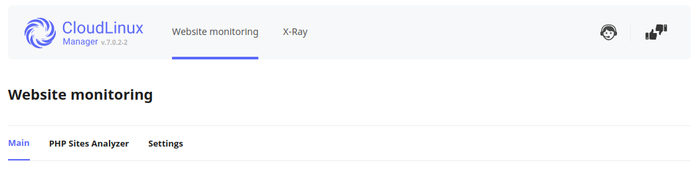

Log in as administrator to get access to the following functionality:

* <span class="notranslate">Dashboard</span> - provides a quick overview of statistics and all administrative information for server administrators;
* <span class="notranslate">Users</span> tab - provides access to manage user limits;
* <span class="notranslate">Options</span> tab - provides access to user interface settings, CageFS and Python/NodeJs selectors;
* <span class="notranslate">Website Monitoring</span> provides access to Website Monitoring and PHP Slow Site Analyzer;
* <span class="notranslate">X-Ray</span> tab - provides access to X-Ray;
* <span class="notranslate">Selector</span> tab - provides access to PHP Selector;
* <span class="notranslate">Smart Advice</span> tab - provides ability to see advice list generated for your WordPress websites;
* <span class="notranslate">AccelerateWP</span> tab - provides access to AccelerateWP;


## Activation

To start using CloudLinux Manager, it must be activated with your CloudLinux OS Solo activation key.

In order to activate CloudLinux Manager features, follow the next steps: 

* Enter your CLN activation key if you already have it 
    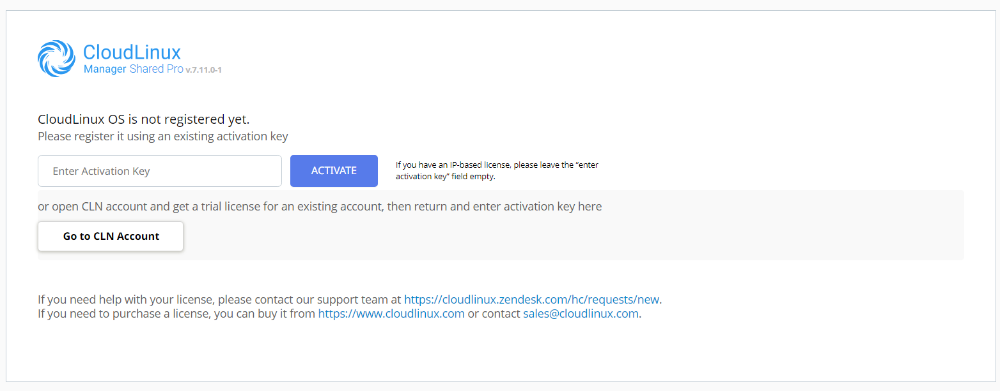
  
    If you have IP-based license, please leave the _Enter Activation Key_ field empty and just click _Activate_.
    
    You can read more about CloudLinux OS Solo and how to get the license [here](https://lp.cloudlinux.com/cloudlinux-os-solo)

## Website Monitoring tool

**Website Monitoring tool (WMT)**  is a tool that collects the statistics of the domains' availability and responsiveness, as well as errors that occur when accessing these domains. An admin can get email reports with the statistics. The Website Monitoring tool uses the simple curl request like `curl http://domain.com` to get domains’ statistics.

You can configure the Website Monitoring tool and the [Slow Site analyzer](/solo/manager/#php-slow-site-analyzer) and view the daily reports in the CloudLinux Manager -> Website monitoring tab.

There are Main, PHP Site analyzer, and Settings subtabs [here](/solo/manager/#main).

:::warning Warning
For now, there is no any possibility to remove the `alt-php-ssa` and `cl-web-monitoring-tool` packages so that the _Website monitoring_ tab will be removed.
You can turn off the _Website monitoring_, _PHP Sites Analyzer_ in the _[Settings](/solo/manager/#wmt-settings)_ tabs, so sites statistics will stop collecting and there will be no additional load on the server.
:::

#### Main

This subtab views the latest report (for the last 24 hours) of the Website monitoring tool.

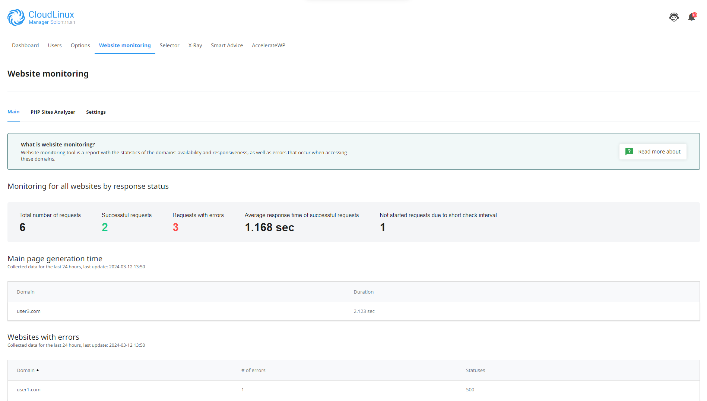

Report is regenerated each time the page is loaded, so all changes in configuration (the [_Settings_](/solo/manager/#wmt-settings) tab) or in the list of domains will be applied immediately.

* **Total number of requests** - requests that were sent to all domains, existing on the servers
* **Successful requests** - the number of requests for all domains with status code 200
* **Requests with errors** - the number of requests for all domains which status code is not 200
* **Not started requests due to short check interval** - this metric is used to adjust configuration. If it is not equal 0, an admin should increase the value of Requests sending interval, because the tool does not fit into this interval to send requests to all domains.
* **Slowest websites in 24h and Websites with most errors in 24h** - in these sections you can find the number of domains that was exposed here.

### WMT Settings

To enable or disable **Website Monitoring**, use the following slider.


* **Email to send report** - all email notifications will be sent to this email address

:::warning Warning
If email is not specified, all [notifications](/solo/manager/#wmt-email-notifications) will be sent to control panel administrator's email.
:::

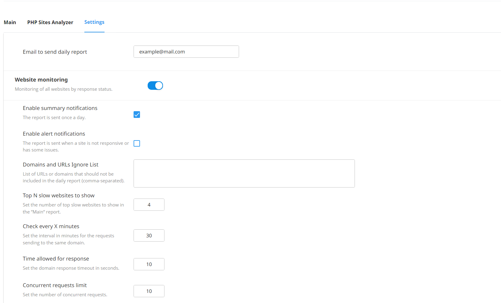

* **Enable summary notifications** - turn on/off summary daily email report notifications
* **Enable alert notifications** - turn on/off immediate alert email notifications
* **Domains and URLs Ignore List** - domains and URLs that will not be requested and displayed in reports; supported formats: `example.com, http://example.com`
* **Top N slow websites to show** - this number (N) will be used to select the top N domains from the list of all domains, sorted by response duration (Slowest websites list). And this number also will be used to select the top N domains from the list of all domains, sorted by amount of errors (Websites with most errors list).
* **Check every X minutes** - this is a period in minutes between requests to the same domain.
* **Time allowed for response** - if there is no answer from the website for this period of time, the Website Monitoring tool will regard this behaviour as the `HTTP 408` error.
* **Concurrent requests limit** - how many concurrent requests can be done by the Website Monitoring tool.

### WMT CLI

The `wmt-api` utility allows managing Website Monitoring tool via CLI.

**Usage**

```
# /usr/share/web-monitoring-tool/wmtbin/wmt-api [command] [--optional arguments]
```

**Optional arguments**:

| | |
|-|-|
|`-h`, `--help`|show help message and exit|

**Commands**:

| | |
|-|-|
|`config-change`|set the WMT configuration using the JSON string that follows the command|
|`config-get`|get the WMT configuration as JSON|
|`report-get`|generate a report for last 24 hours|
|`send-clickhouse`|send the summary report to the ClickHouse|
|`start`|start the WMT system|
|`status`|check the status of the WMT system|
|`stop`|stop the WMT system|

Example of the `/usr/share/web-monitoring-tool/wmtbin/wmt-api` command usage:

```
/usr/share/web-monitoring-tool/wmtbin/wmt-api --config-change "{\"ping_timeout\":10,\"ping_interval\":5,\"report_email\":\"user@example.com\"}"
```

This way you can set all or only certain parameters.

### WMT email notifications

There are two types of emails sent by the Web Monitoring tool: **daily email report** and **alert**.

#### Daily email report

The summary report with all data for the previous day. It is created and sent every day at midnight.


**Example of the Web Monitoring tools daily report**.


#### Alert

Domains that are responding with non-200 status code will be re-requested in 5 minutes or in the `ping_interval` setting (in case it is less than 5 minutes).

If domains are still responding with non-200 status code - Web Monitoring tool will inform about such domains with immediate alert email.

**Example of the Web monitoring tools immediate alert**.


:::tip Note
The next alert with domains will not be sent in less than 6 hours. Also, if the alerted domain is still responding with non-200 status code even after 6 hours - it will not be re-alerted until it responds with 200 status code at least once and becomes unavailable again.
:::

## PHP Slow Site analyzer

**PHP Slow Site analyzer** (**SSA**) is a tool that generates daily reports for the server administrator with information about the top N slow PHP-based URLs for all domains. The Slow Site analyzer tracks all PHP-based requests and selects slow ones by specific rules.

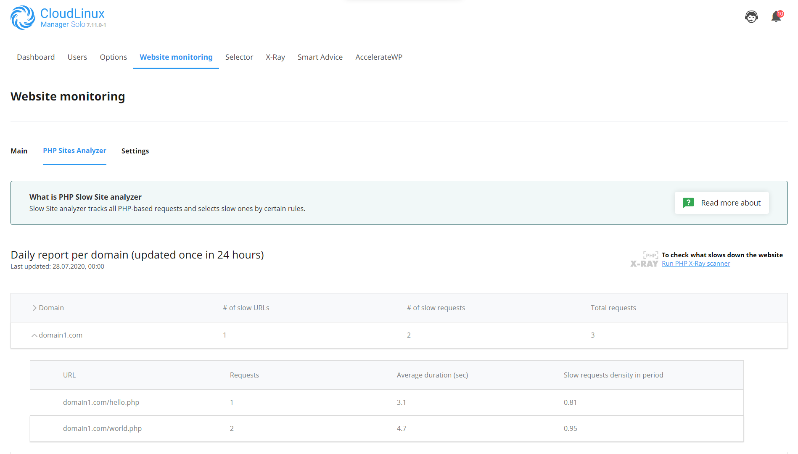

This is an example of a report from the Slow Site analyzer. The report shows the number of slow requests per domain and its URLs and the average duration of each slow URL.


### SSA settings

To enable or disable the **Slow Site analyzer**, use the following slider:


The following settings can be changed through the UI:

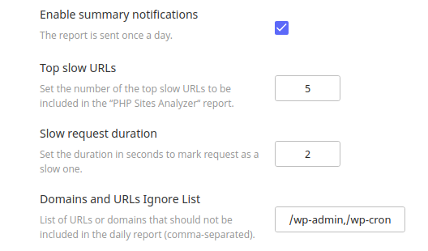

* **Enable Autotracing** - turn on/off Autotracing;
* **Enable summary notifications** - turn on/off summary daily email report notifications;
* **Top N slow websites to show** - Set the number of top slow websites to show in the “PHP Sites Analyzer“ report;
* **Top slow URLs** - this number (N) will be used to select the top N URLs for each domain, marked as slow;
* **Slow request duration** - the duration of a request in seconds. If the request duration was less than specified in this setting then this request will not be marked as slow;
* **Slow requests number** - number of slow requests in the period of time to mark the URL as a slow one;
* **Analysis time** - the period of time in hours required to analyze slow requests;
* **Enable slow requests density threshold** - turn on/off slow requests density threshold;
* **Slow requests density threshold** - can be in the interval [0..1], by default it is 0.8. The **density threshold** can be disabled. And the **Domains and URLs Ignore List** can be specified;
* **Domains and URLs Ignore List** - domains and URLs that will not be displayed in reports;


### SSA CLI

The `cloudlinux-ssa-manager` utility allows to manage Slow Site analyzer via CLI.

**Usage**

```
/usr/sbin/cloudlinux-ssa-manager [command] [--optional arguments]
```

**Optional arguments**:

| | |
|-|-|
|`-h`, `--help`|show help message and exit|

**Commands**:

| | |
|-|-|
|`set-config`|set the SSA configuration|
|`get-config`|get the SSA configuration|
|`get-ssa-status`|get a current status of SSA|
|`enable-ssa`|enable SSA|
|`disable-ssa`|disable SSA|
|`get-report`|get the latest report|

You can use the `-h`, `--help` option with commands to get a full list of available optional arguments for each command.

Example of the `/usr/sbin/cloudlinux-ssa-manager get-report | json_reformat` command output:

```
/usr/sbin/cloudlinux-ssa-manager get-report | json_reformat  

{
    "result": "success",
    "date": "18.05.2021",
    "domains": [
        {
            "name": "user1.com",
            "slow_urls": 2,
            "slow_reqs": 23,
            "total_reqs": 24,
            "urls": [
                {
                    "name": "http://user1.com/",
                    "reqs_num": 13,
                    "average_duration": 3004509
                },
                {
                    "name": "http://user1.com/info.php",
                    "reqs_num": 10,
                    "average_duration": 3641018
                }
            ]
        },
        {
            "name": "user2.com",
            "slow_urls": 1,
            "slow_reqs": 12,
            "total_reqs": 12,
            "urls": [
                {
                    "name": "http://user2.com/",
                    "reqs_num": 12,
                    "average_duration": 3010571
                }
            ]
        }
    ]
}
```

Example of the `/usr/sbin/cloudlinux-ssa-manager set-config --requests-duration 2.5` command output:

```
/usr/sbin/cloudlinux-ssa-manager set-config --requests-duration 2.5 

{"result": "success"}
```


### SSA email notifications

SSA sends email reports daily if the "**Enable summary notifications**" setting is turned on.

**Example of the PHP Slow Site analyzer report**:

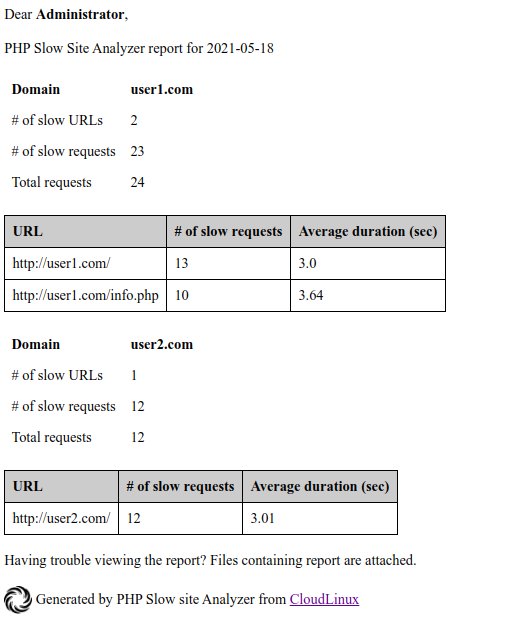


## X-Ray

* [Description](/solo/manager/#description)
* [How to manage X-Ray](/solo/manager/#how-to-manage-x-ray)
* [Managing tracing task](/solo/manager/#managing-tracing-task)
* [Managing continuous tasks](/solo/manager/#managing-continuous-tasks)
* [X-Ray Autotracing](/solo/manager/#x-ray-autotracing)
* [End-user X-Ray plugin](/solo/manager/#end-user-x-ray-plugin)
* [X-Ray client](/solo/manager/#x-ray-client)
* [X-Ray service](/solo/manager/#x-ray-agent)
* [FAQ](/solo/manager/#faq)

### Description

X-Ray is a tool developed for website performance monitoring and performance issues detection.

X-Ray can gather and visualize information about top N slowest system functions, external requests, software modules and database queries of the website.

### How to manage X-Ray

X-Ray provides two options for monitoring domain requests speed: Tracing task and Continuous task.

* **Tracing task** is a task created manually for a specific URL to collect server requests. The task will end either after a specified number of requests to the URL or after a specified time (maximum after two days). It is not possible here to automatically email a report but it is possible to export the report in PDF and send to a user.

* **Continuous task** is a task that initiates a daily hourly tracing requests for a specified domain and email a monitoring report. Continuous task can't stop automatically, you need to stop it manually.

In fact, continuous task allows to automatically create a tracing task for each new day, with the ability to get a report for the past day.


## X-Ray serverwide mode

With X-Ray v0.6-11 we introduced global X-Ray mode which enables tracing extension for all PHP versions on the servers. This
mode allows your customers to [override PHP versions](https://cloudlinux.zendesk.com/hc/en-us/articles/115004537805-Different-PHP-versions-per-directories-using-mod-lsapi) 
in different folders and trace websites located in those folders.

In order to enable this mode, type the following command:
```
cloudlinux-xray-manager enable-serverwide-mode
```

In order to get back to default:
```
cloudlinux-xray-manager disable-serverwide-mode
```

Enable and disable commands do not stop or remove tracing tasks.

## X-Ray phpinfo mode

With X-Ray v0.6-18 we introduced new X-Ray mode which gathers website php version using information from phpinfo. This
mode allows your customers to [override PHP versions](https://cloudlinux.zendesk.com/hc/en-us/articles/115004537805-Different-PHP-versions-per-directories-using-mod-lsapi)

:::warning
In order to use this mode, websites should be reachable through http or https.
:::

In order to enable this mode, type the following command:
```
touch /opt/cloudlinux/flags/enabled-flags.d/xray-per-domain-php-version-mode.flag
```

In order to get back to default:
```
rm -f /opt/cloudlinux/flags/enabled-flags.d/xray-per-domain-php-version-mode.flag
```


#### Tracing tasks tab

The *Tracing tasks* tab contains a list of all tracing tasks created both manually and automatically via continuous tasks.


The *Created* column shows how a task was created – automatically (by continuous task) or manually.

#### Continuous tracing tab
  
The *Continuous tracing* tab contains a list of continuous tasks for which tracing tasks will be created automatically for a new day for a specific domain.


### Managing tracing task

#### Creating a new tracing task

1. Go to the <span class="notranslate">_X-Ray_</span> tab
2. Click the <span class="notranslate">_Start tracing_</span> button to create a new task
3. In the opened popup specify a website URL to trace
4. Click the <span class="notranslate">_Run_</span> button
5. Tracing will run in the default mode. In the default mode <span class="notranslate">X-Ray</span> traces the first 20 requests for a specified URL


* <span class="notranslate">**URL**</span> should be a valid URL of the domain which exists on the current hosting server. The URL field supports wildcard matching. To learn more about wildcard matching, click _How to use special characters_.
* <span class="notranslate">**Advanced settings**</span> allow you to set an IP address and tracing options: by time or by number of queries.

    

**Advanced settings**

* <span class="notranslate">**Client’s IP**</span>: it is an IPv4 address of a machine to trace. For example, if you have a production website that processes requests from different IP addresses and you do not want to add these requests to the tracing task. So, you can set a specific IP address and <span class="notranslate">X-Ray</span> will analyze requests only from this specific IP address.
Record for
* <span class="notranslate">**Time period**</span>: how much time <span class="notranslate">X-Ray</span> collect the requests (2 days max)
* <span class="notranslate">**Requests**</span>: the amount of requests that <span class="notranslate">X-Ray</span> will collect

After creating, the task appears in the list of tracing tasks.


#### Viewing tracing tasks list


Tasks created *Manually* are simply tracing tasks.

#### Tracing status

A tracing task can have the following statuses:

* <span class="notranslate">**Running**</span> – tracing is in progress
* <span class="notranslate">**Stopped**</span> – tracing was stopped by administrator
* <span class="notranslate">**On hold**</span> – the same URL already exists in the lists. Task processing will not start automatically. Administrator should start it manually.
* <span class="notranslate">**Completed**</span> – period of time is finished or number of requests is reached.

#### Collected requests for tracing task

:::warning Warning!
Collected requests are available in the UI for two weeks.
:::

Click  to open a list of collected requests.

#### Tracing tasks


The slowest request is highlighted.


* <span class="notranslate">**Total**</span> displays how many requests were collected according to tasks requirements.
* <span class="notranslate">**Pending**</span> displays how many of collected requests are not visible in the table yet.
* <span class="notranslate">**Slow**</span> displays the number of requests lasting more than one second.

There are filters for the request types and the indicator of a filter used now.


If slow requests were not detected during the tracing task, the following is displayed. Here, you can also view all requests.


<span class="notranslate">X-Ray</span> collects the following data for each request:

* <span class="notranslate">**Top issues**</span> – the slowest items of a request
* <span class="notranslate">**Software modules/plugins**</span> by execution time (only for WordPress plugins)
* <span class="notranslate">**Database queries**</span> by execution time 
* <span class="notranslate">**External requests**</span> by execution time
* <span class="notranslate">**Other system functions**</span> by execution time 

#### Software modules/plugins


The <span class="notranslate">_Software modules/plugins_</span> section displays the following data:

* <span class="notranslate">**Software type**</span> – a type a module/plugin. For now, <span class="notranslate">X-Ray</span> can analyze only WordPress software
* <span class="notranslate">**Software module**</span> – a name of the WordPress plugin
* <span class="notranslate">**Duration**</span> – plugin execution time
* <span class="notranslate">**Duration (%)**</span> – plugin execution time as a percentage of the total duration of the request

#### Database queries


The <span class="notranslate">_Database queries_</span> section displays the following data:

* <span class="notranslate">**Query**</span> – the executed SQL-query
* <span class="notranslate">**File**</span> – the file and the line of the executed query and backtrace
* <span class="notranslate">**Software module**</span> – a WordPress plugin name from which the request was completed. If the request does not belong to any of the WordPress plugin, the name of the function that executed the given request is displayed
* <span class="notranslate">**Calls**</span> – the number of identical SQL queries
* <span class="notranslate">**Duration**</span> – execution time as a percentage of the total duration of a request and the function processing time (in brackets)
 
#### External requests


The <span class="notranslate">_External requests_</span> section displays the following data:

* <span class="notranslate">**URL**</span> – the URL of the executed request
* <span class="notranslate">**File**</span> – the file and the line of the executed request and backtrace
* <span class="notranslate">**Duration**</span> – execution time as a percentage of the total duration of a request and the function processing time (in brackets)
 
#### System functions


The <span class="notranslate">_System functions_</span> section displays the following data:

* <span class="notranslate">**Function**</span> – the executed function
* <span class="notranslate">**File**</span> – the file and the line of the executed request
* <span class="notranslate">**Duration**</span> – execution time as a percentage of the total duration of a request and the function processing time (in brackets)

#### Stopping tracing task

Click  to stop the tracing task.


The tracing task status will be changed to <span class="notranslate">**Stopped**</span>. Data will not be collected anymore but you can see already collected information or continue tracing later by clicking .

#### Deleting tracing task 

Click  to delete the tracing task.

:::warning Warning!
When you have deleted a tracing task, all collected data will be unavailable.
:::

### Managing continuous tasks

#### Creating a new continuous task

1. Click the *Create continuous tracing*  button 


2. Specify URL in the *Domain* field and email in the *Email for reports* field and click the *Create* button.


3. You can see a new task in the *Continuous tracing* tab in the X-Ray UI.


4. If you stop a continuous tracing task, a new task for the next 24 hours will not be created. The task for the current day will be finished at midnight and the report will be emailed.

5. If you delete a continuous tracing task, the task for the current day will be finished at midnight and the report will be emailed.

#### Viewing continuous tasks list

You can find a list of continuous tracing tasks in the _Continuous tracing_ tab.


You can find automatically created tasks in the _Tracing tasks_ tab marked as _Automatically_ in the _Created_ column.


The [statuses for automatically created tasks](/solo/manager/#tracing-status) are the same as for tracing task.

To view detailed info about an automatically created task, click . You will get requests grouped by hour.


Click to a group to open a list of the requests.


The following data is collected for each request:

* Software modules/plugins by execution time (only for WordPress plugins)
* Database queries by execution time
* External requests by execution time
* Other system functions by execution time

#### Stopping automatic tracing task

Stopping automatic tracing task (a part of continuous tracing task) affects only the automatic tracing task for the current day. A new task for the next day will be created at the end of the day.

To stop the continuous tracing task completely, see [Creating a new continuous task, paragraph 4](/solo/manager/#creating-a-new-continuous-task).


#### Deleting automatic tracing task

Deleting automatic tracing task (a part of continuous tracing task) affects only the automatic tracing task for the current day. A new task for the next day will be created at the end of the day.

To delete the continuous tracing task completely, see [Creating a new continuous task, paragraph 5](/solo/manager/#creating-a-new-continuous-task).


#### Continuous task daily report

1. Users get daily reports on their emails. An example of a report is shown below:

    

2. Click the link in the email to show the detailed report:

    

3. You can view requests grouped by hour:

    

4. You can also view the detailed information about request:

    


### X-Ray Autotracing

X-Ray Autotracing automatically creates tracing tasks for slow URLs that were found during a day by the [PHP Slow Site Analyzer](/legacy/lve_manager/#website-monitoring-tool-and-slow-site-analyzer) (SSA).

:::warning Warning
To use X-Ray Autotracing, update your alt-php-ssa and alt-php-xray packages to versions alt-php-ssa-0.2-1 and alt-php-xray-0.4-1 or higher by running the following command:
```
yum update alt-php-ssa alt-php-xray --enablerepo=cloudlinux-updates-testing
```
:::

#### How to enable X-Ray Autotracing

To enable X-Ray Autotracing, run the following commands via SSH:

```
/usr/sbin/cloudlinux-ssa-manager enable-ssa
/usr/sbin/cloudlinux-xray-autotracing enable --all
```

Check [CLI documentation](/solo/manager/#x-ray-autotracing-cli) for a description of the `/usr/sbin/cloudlinux-xray-autotracing` CLI utility.

#### Requirements

* CloudLinux OS Shared Pro or CloudLinux OS Solo
* alt-php-ssa > 0.2-1 version
* alt-php-xray > 0.4-1 version
* Enabled PHP SSA on the server

#### Autotracing Interface

A new tab for Autotracing tasks was added to the X-Ray UI:


#### Autotracing FAQ

Q: Why are the slow URLs in the Slow Site Analyzer report different from those on which the autotracing tasks were created?

A: Because the autotracing decision module uses rules and thresholds different from Slow Site Analyzer, which are configured by the CloudLinux team.

Q: How often autotracing tasks will be generated?

A: Once a day at the same time as a Slow Site Analyzer report.


#### X-Ray Autotracing CLI


The `cloudlinux-xray-autotracing` utility allows to manage the X-Ray Autotracing via CLI.

**Usage**

```
/usr/sbin/cloudlinux-xray-autotracing [command] [--optional arguments]
```

**Commands**:

| | |
|-|-|
|`enable`|Enable X-Ray Autotracing|
|`disable`|Disable X-Ray Autotracing|
|`status`|Get current status of the X-Ray Autotracing|

**Optional arguments**:

| | |
|-|-|
|`-h`, `--help`|Show help message and exit|
|`--all`|Enable or disable for all users|
|`{username}`|Enable/disable the specified user|
|`--list-disabled`|Show list of disabled users|

You can use the `-h`, `--help` option with commands to get a full list of available optional arguments for each command.

**Example usage:**

Disable user1:
	
```
/usr/sbin/cloudlinux-xray-autotracing disable user1  

{"result": "success"}
```

Show list of disabled users:
	
```
/usr/sbin/cloudlinux-xray-autotracing status --list-disabled  

{"result": "success", "disabled_users": ["user1"]}
```
	
Enable all:

```
/usr/sbin/cloudlinux-xray-autotracing enable --all  

{"result": "success"}
```


### X-Ray Smart Advice

Smart advice is a new feature of X-Ray that is designed to find and propose solutions to fix performance issues and speed up the performance of a sites.

:::tip Note
Smart Advice will work only for CloudLinux OS Solo servers with cPanel or Plesk Control Panel for now.

At the moment, Smart Advice is focused only on WordPress sites.
:::

:::warning Warning
To use X-Ray Smart Advice, update your alt-php-ssa and alt-php-xray packages to versions alt-php-ssa-0.2-3 and alt-php-xray-0.5-1 or higher by running the following command:
```
yum update alt-php-ssa alt-php-xray lve-utils lvemanager --enablerepo=cloudlinux-updates-testing
```
:::

#### Requirements

* CloudLinux OS Shared Pro or CloudLinux OS Solo
* alt-php-xray > 0.5-1 version
* lve-utils > 6.3.2-1 version
* lvemanager > 7.6.1-1 version
* cloudlinux-site-optimization-module > 0.1-1 version

We Recommend:

* Enable [X-Ray Autotracing](/solo/manager/#x-ray-autotracing) on the server
* Use alt-php-ssa > 0.2-3 version

#### How X-Ray Smart Advice works

The main process of looking for advice is X-Ray tracing tasks. The best way for doing this is to enable X-Ray Autotracing. 
This will allow you to most effectively find Smart Advice for sites that have performance issues without your manual participation. 
You can find information on how to enable X-Ray Autotracing [here](/solo/manager/#how-to-enable-x-ray-autotracing).
On the other hand, you can create tracing tasks manually or use continuous X-Ray but we suggest you use X-Ray Autotracing for this purpose.

:::tip Note
Advice will not be generated by old tracing tasks.
:::

While the tracing task is running, X-Ray will look for places where advice can be applied. New advice will be displayed on the *Smart Advice* tab. 


#### Smart Advice FAQ

Q: Why I can't see new advice on the *Smart Advice* tab?

A: For the generating of advice, it is necessary to run X-Ray tracing tasks, the best way to do it without manual interaction is to use X-Ray Autoracing. You can find more information on how to enable X-Ray Autotracing [here](/solo/manager/#how-to-enable-x-ray-autotracing).

#### Useful Smart Advice CLI commands

:::warning Warning!
This is an experimental feature. The backwards compatibility is not guaranteed.
:::

To obtain the full list of advice generated for your server use the following CLI command:

```
cl-smart-advice list
```

For each advice in the list the CLI command returns the following information:
* `metadata`, which includes information about `username`, `domain` and `website` for which the advice is issued
* `advice` information:
  * its identifier `id`
  * its `type`
  * its `status` -- `review` or `applied`
  * if advice is Premium `is_premium`
  * other internal informational fields

The example output is given below:

```
{
  "data": [
    {
      "created_at": "2023-04-11T07:33:48.191870+00:00",
      "updated_at": "2023-04-11T07:33:48.191870+00:00",
      "metadata": {
        "username": "user16",
        "domain": "user16.com",
        "website": "/wordpress"
      },
      "advice": {
        "id": 23484,
        "type": "OBJECT_CACHE",
        "status": "review",
        "description": "Turn on Object Caching",
        "is_premium": true,
        "module_name": "object_cache",
        "subscription": {
          "status": "no",
          "upgrade_url": null
        },
        "total_stages": 0,
        "completed_stages": 0,
        "detailed_description": "To improve site performance, enable the Object Caching We recommend applying the advice if you see it frequen
tly for the most valuable URLs of your site."
      }
    },
    {
      "created_at": "2023-04-11T07:33:48.297784+00:00",
      "updated_at": "2023-04-11T08:51:42.362117+00:00",
      "metadata": {
        "username": "user16",
        "domain": "user16.com",
        "website": "/wordpress"
      },
      "advice": {
        "id": 23485,
        "type": "SITE_OPTIMIZATION",
        "status": "applied",
        "description": "Turn on AccelerateWP feature",
        "is_premium": false,
        "module_name": "accelerate_wp",
        "total_stages": 0,
        "completed_stages": 0,
        "detailed_description": "To improve site performance, enable the AccelerateWP optimization feature. We recommend applying the advice if you see it frequently for the most valuable URLs of your site."
      }
    }
  ],
  "result": "success",
  "timestamp": 1681203110
}
```


### End-user X-Ray plugin

Please refer to the [CloudLinux OS Solo user documentation](/user-docs/user-docs-solo-cloudlinux/#end-user-x-ray-plugin).


### X-Ray client

X-Ray client is a PHP extension named `xray.so`. It analyzes the processing time of the entire request and its parts and then sends the data to the X-Ray agent.

#### List of supported PHP versions

The list of currently supported PHP versions:

| | | | | |
|-|-|-|-|-|
|**ALT PHP**:|**EA PHP**:|**Plesk PHP**|**DirectAdmin PHP**|**Other panels PHP**|
| <ul><li>alt-php54</li><li>alt-php55</li><li>alt-php56</li><li>alt-php70</li><li>alt-php71</li><li>alt-php72</li><li>alt-php73</li><li>alt-php74</li></ul>|<ul><li>ea-php54</li><li>ea-php55</li><li>ea-php56</li><li>ea-php70</li><li>ea-php71</li><li>ea-php72</li><li>ea-php73</li><li>ea-php74</li></ul>|<ul><li>php54</li><li>php55</li><li>php56</li><li>php70</li><li>php71</li><li>php72</li><li>php73</li><li>php74</li></ul>|<ul><li>php54</li><li>php55</li><li>php56</li><li>php70</li><li>php71</li><li>php72</li><li>php73</li><li>php74</li></ul>|<ul><li>54</li><li>55</li><li>56</li><li>70</li><li>71</li><li>72</li><li>73</li><li>74</li></ul>|


#### Functions that X-Ray client can hook

#### Database queries

* Functions from the [MySQL](https://www.php.net/manual/ru/book.mysql.php) extension:
    * <span class="notranslate">`mysql_query`</span>
    * <span class="notranslate">`mysql_db_query`</span>
    * <span class="notranslate">`mysql_unbuffered_query`</span>
* Functions from the [MySQLi](https://www.php.net/manual/ru/book.mysqli.php) extension:
    * <span class="notranslate">`mysqli_query`</span>
    * <span class="notranslate">`mysqli::query`</span>
    * <span class="notranslate">`mysqli_multi_query`</span>
    * <span class="notranslate">`mysqli::multi_query`</span>
    * <span class="notranslate">`mysqli_real_query`</span>
    * <span class="notranslate">`mysqli::real_query`</span>
* Functions from the [PDO](https://www.php.net/manual/ru/book.pdo.php) extension:
    * <span class="notranslate">`PDO::exec`</span>
    * <span class="notranslate">`PDO::query`</span>
    * <span class="notranslate">`PDOStatement::execute`</span>

#### External requests

* Function [curl_exec](https://www.php.net/manual/ru/function.exec)

#### System PHP functions

It may be any PHP system function which can be related to a PHP engine or other PHP extension, for example <span class="notranslate">`fopen()`</span> or <span class="notranslate">`json_encode()`</span>. A list of these functions can be found [here](https://www.php.net/manual/en/indexes.functions.php).

#### Configuration Options

<div class="notranslate">

#### xray.enabled

</div>

**Syntax**: <span class="notranslate">`xray.enabled=On/Off`</span>

**Default**: <span class="notranslate">On</span>

**Changeable**: <span class="notranslate">PHP_INI_SYSTEM</span>

**Description**: Enable or disable <span class="notranslate">X-Ray</span> extension from php.ini

-----

<div class="notranslate">

#### xray.database_queries

</div>

**Syntax**: <span class="notranslate">`xray.database_queries=[number]`</span>

**Default**: 20

**Changeable**: <span class="notranslate">PHP_INI_SYSTEM</span>

**Description**: The number of the slowest SQL queries which will be sent to the <span class="notranslate">X-Ray</span> agent. The min value is 0 and the max value is 100. If the variable value is more, the default value will be used.

-----

<div class="notranslate">

#### xray.external_requests

</div>

**Syntax**: <span class="notranslate">`xray.external_requests=[number]`</span>

**Default**: 20

**Changeable**: <span class="notranslate">PHP_INI_SYSTEM</span>

**Description**: The number of the slowest external requests (the curl_exec function) which will be sent to the <span class="notranslate">X-Ray</span> agent. The min value is 0 and the max value is 100. If the variable value is more, the default value will be used.

-----

<div class="notranslate">

#### xray.system_functions

</div>

**Syntax**: <span class="notranslate">`xray.system_functions=[number]`</span>

**Default**: 20

**Changeable**: <span class="notranslate">PHP_INI_SYSTEM</span>

**Description**: The number of the slowest system functions which will be sent to the <span class="notranslate">X-Ray</span> agent. 
The min value is 0 and the max value is 100. If the variable value is more, the default value will be used.

-----

<div class="notranslate">

#### xray.backtrace_depth

</div>

**Syntax**: <span class="notranslate">`xray.backtrace_depth=[number]`</span>

**Default**: 10

**Changeable**: <span class="notranslate">PHP_INI_SYSTEM</span>

**Description**: The backtrace depth to the main() function which will be sent to the <span class="notranslate">X-Ray</span> agent. The min value is 0 and the max value is 20. If the variable value is more, the default value will be used.

-----

<div class="notranslate">

#### xray.processor

</div>


**Syntax**: <span class="notranslate">`xray.processor=[processor_name]`</span>

**Default**: <span class="notranslate">xray</span>

**Changeable**:  <span class="notranslate">PHP_INI_SYSTEM</span>

**Description**: Tells the <span class="notranslate">X-Ray</span> client which processor to use. The new processors may be added in the future. The default processor is xray which means to send data to the <span class="notranslate">X-Ray</span> agent.

-----

<div class="notranslate">

#### xray.tasks

</div>

**Syntax**: <span class="notranslate">`xray.tasks=host:uri:ip:id`</span>

**Default**: <span class="notranslate">no value</span>

**Changeable**:  <span class="notranslate">PHP_INI_SYSTEM</span>

**Description**: The current tracing tasks for the given PHP request. This directive is added automatically by the <span class="notranslate">X-Ray</span> manager when creating a task. It is not allowed to edit manually, as <span class="notranslate">X-Ray</span> may stop working.

-----

<div class="notranslate">

#### xray.to_file

</div>

**Syntax**: <span class="notranslate">`xray.to_file=On/Off`</span>

**Default**: <span class="notranslate">Off</span>

**Changeable**:  <span class="notranslate">PHP_INI_SYSTEM</span>

**Description**: Only for debug purposes. Writes to a file data which is sent to the processor.

-----

<div class="notranslate">

#### xray.debug

</div>

**Syntax**: <span class="notranslate">`xray.debug=On/Off`</span>

**Default**: <span class="notranslate">Off</span>

**Changeable**: <span class="notranslate">PHP_INI_SYSTEM</span>

**Description**: Only for debug purposes. Enables debug output during request processing. In the On mode can slow down the domain.

-----

<div class="notranslate">

#### xray.debug_file

</div>

**Syntax**: <span class="notranslate">`xray.debug_file=[path_to_file]`</span>

**Default**: <span class="notranslate">`/tmp/xray-debug.log`</span>

**Changeable**: <span class="notranslate">PHP_INI_SYSTEM</span>

**Description**: Only for debug purposes. Specifies a file for logging debug information.


### X-Ray agent 


This is a service that receives data from the <span class="notranslate">X-Ray</span> client and sends it to the remote storage.

#### Managing X-Ray service

The <span class="notranslate">X-Ray</span> agent is managed by the <span class="notranslate">`service`</span> utility.

* To start the <span class="notranslate">X-Ray</span> agent, run the following command:

    <div class="notranslate">

    ```
    service xray-agent start
    ```
    </div>

* To stop the <span class="notranslate">X-Ray</span> agent, run the following command:

    <div class="notranslate">

    ```
    service xray-agent stop
    ```
    </div>

* To restart the <span class="notranslate">X-Ray</span> agent, run the following command:

    <div class="notranslate">

    ```
    service xray-agent restart
    ```
    </div>

### FAQ

#### Does X-Ray affect website performance?

<span class="notranslate">X-Ray</span> affects website performance. Our tests show 5-10 % overhead from a website loading time with <span class="notranslate">X-Ray</span> tracing enabled.
<span class="notranslate">X-Ray</span> allows you to find website performance issues and should not be enabled permanently. If your website is very slow, you can enable <span class="notranslate">X-Ray</span> to find the cause and then disable it.


### My customers [override php versions](https://cloudlinux.zendesk.com/hc/en-us/articles/115004537805-Different-PHP-versions-per-directories-using-mod-lsapi) in different folders and X-Ray does not trace those websites, what should I do?

You should turn on the [X-Ray serverwide mode](#x-ray-serverwide-mode) or the [X-Ray phpinfo mode](#x-ray-phpinfo-mode).


#### What should I do if I see the warning "Task is duplicated by URL"?

This warning means that you already have a task to trace this URL in the list of your tracing tasks. If you see this warning, a new task can be created only with the <span class="notranslate">_On hold_</span> status and you will be able to run it only when the previous task with the same URL will be completed.

Note that the URL field supports wildcard matching and you can have a case when <span class="notranslate">X-Ray</span> is tracing the <span class="notranslate">`URL=domain.com/*`</span> and you are trying to create a new task with <span class="notranslate">`URL=domain.com/xray.php`</span>. In this case, you will see that warning because the `*` URLs array includes <span class="notranslate">`xray.php`</span>.

####  I started a tracing task and made requests to URL but did not see any results in the UI. What should I do?

1. Check that <span class="notranslate">**xray**</span> extension is enabled for the domain. To do so, go to the <span class="notranslate">`phpinfo()`</span> page and make a request. In the phpinfo output try to find the following section:
   
    

If you cannot see that section, try to restart PHP processes for that user (the simplest way is to restart Apache) and check that you can see the <span class="notranslate">**xray**</span> extension.


2. If you can see the <span class="notranslate">**xray**</span> extension in the phpinfo, check that <span class="notranslate">X-Ray</span> agent service is running with the service xray-agent status command. If it is not running, start it with the <span class="notranslate">`service xray-agent start`</span> command.
3. <span class="notranslate">X-Ray</span> may not send data if a site uses a caching plugin, as the caching plugin is outputting HTML, thus there are no PHP scripts to examine. We encountered such issues with sites that use <span class="notranslate">LSCache</span> and <span class="notranslate">WP Super Cache</span> plugins. Check that your site does not use caching plugins. If so, disable it while tracing a site to get information from <span class="notranslate">X-Ray</span>.
4. If you set a client’s IP when creating the tracing task, check that your requests come to the server with this IP via phpinfo (since there may be NAT between your local machine and the server).
   
    

5. If, after checking the previous items, the issue persists, [contact our support team](https://cloudlinux.zendesk.com/hc/en-us/requests/new).

#### What to do if X-Ray is not found in the phpinfo() page?

If you managed to create a tracing task, this means that the <span class="notranslate">`xray.ini`</span> file was created in a system. Therefore, there may be two reasons why it did not appear in the phpinfo page of the domain.

1. PHP process wasn't reloaded after adding the xray.ini. To solve this, you should restart the Apache or fpm service for the domain on which the tracing was started. At the moment, this is done automatically by the <span class="notranslate">X-Ray</span> manager after creating the task.
2. Your domain uses a PHP version different from the one which was detected by the <span class="notranslate">X-Ray</span> manager. To solve this, check the scan dir for additional ini files for your domain.

    

    Then check the <span class="notranslate">`ini_location`</span> that was passed to the <span class="notranslate">X-Ray</span> manager by running the following command:

    <div class="notranslate">

    ```
    cat /usr/share/alt-php-xray/manager.log | grep ini_location
    ```
    </div>

    Find your tracing task in the output and check that the <span class="notranslate">`xray.ini`</span> exists in this directory, also check that the `ini` path is the same in the phpinfo page output and in the <span class="notranslate">`ini_location`</span> directive for your tracing task. If they are the same, you should reload your PHP. If they are different that means that the <span class="notranslate">X-Ray</span> manager could not correctly determine the PHP version your domain uses. In this case, contact our support team at [https://cloudlinux.zendesk.com/hc/requests/new](https://cloudlinux.zendesk.com/hc/requests/new).


#### I use LiteSpeed, X-Ray is enabled and it is shown in the phpinfo() page but does not collect data when sending requests to a site. What to do?

Check for the <span class="notranslate">`CacheLookup on`</span> option in the `htaccess` file for your domain.
If the option is there, LiteSpeed processes requests bypassing the PHP X-Ray extension.
In this case, to get tracing information, you should remove the <span class="notranslate">`CacheLookup on`</span> option.

#### What is the proper format for the URL?

All of the examples below are correct:

* `http://domain.com`
* `http://domain.com/`
* `https://domain.com`
* `https://domain.com/`

You can use any of them with a prefix `www.` and it is also correct.


## AccelerateWP

### Get started

AccelerateWP carries a suite of optimization features that can be enabled and automatically configured for the end-user's site.

There are AccelerateWP and AccelerateWP Premium feature suites.

AccelerateWP suite is always enabled when AccelerateWP is turned on. Choose whether you want to offer AccelerateWP Premium 
for your users and click "Turn on" to start exploring AccelerateWP. 


Once the AccelerateWP suite is enabled by administrator,
end-users will see an AccelerateWP tab in their cPanel interface and be able to activate the optimization feature.

When AccelerateWP Premium suite enabled by administrator, 
end-users will see the Object Caching feature in their interface, 
but cannot install the plugin unless they purchase the feature using WHMCS or 3'd party billing.

#### AccelerateWP suite
This is a basic suite which includes [AccelerateWP base feature](/user-docs/user-docs-shared-cloudlinux/#acceleratewp-feature-wordpress-optimization-plugin): 
a WordPress optimization plugin that provides full page caching, GZIP compression and some other useful optimizations.

**AccelerateWP suite limitations**
* the website must be served with Apache web server;
* the website must use PHP version 7.3 or higher.
* the WordPress version must be 5.8 and higher.
* the other WordPress Caching plugins must not be installed.
* the WordPress should not run in Multisite mode.

:::tip Note
Some AccelerateWP functions depend on external services. For the functions to work properly, the following URLs and IPs need to be allowed at all security levels:

* https://awp-saas.cloudlinux.com
* 213.239.192.204
:::

#### AccelerateWP Premium suite

:::warning Attention
This feature is free of charge only during the beta testing period. 
Afterwards it will be charged. Beta testing period ends no earlier than March 2023.
:::

This is a premium suite which includes [Object Caching feature](/user-docs/user-docs-shared-cloudlinux/#acceleratewp-premium-object-caching-feature).

The Object Caching mechanism stores database query results in additional storage for quick access. 
This mechanism is really helpful in case if website needs to process multiple pages per second as 
requests come in and may be helpful in case when full page caching cannot be used, e.g. on personalized pages.

**Premium suite limitations**


* the website must be served with Apache web server;
* the website must use one of the following PHP handlers:
  * [php-fpm](https://blog.cpanel.com/how-to-use-php-fpm-with-cpanel/)
  * [lsapi](/legacy/cloudlinux_os_components/#apache-mod-lsapi-pro)
* the website must use ea-PHP version 7.4 or 8.0.
* the WordPress version must be 3.7 and higher.
* the other WordPress Caching plugins must not be installed.
* the [Snuffleupagus](https://snuffleupagus.readthedocs.io/) must be turned off.
* the WordPress should not run in Multisite mode.


### Limitations
There are the following requirements to use AccelerateWP:
* the server must have CloudLinux Shared PRO license;
* the server must be powered with cPanel.


### Administrator interface

#### Overview

In the _CloudLinux Manager → AccelerateWP_ tab Administrator has the opportunity to provide end-user with suites of features, which on its turn could be activated by end-user. To provide best experience,
[activate free features for all WordPress sites](/solo/manager/#activate-free-acceleratewp-for-all-wordpress-sites-on-the-server).


By toggling the `Enable AccelerateWP for all users` an administrator provides end-users with AccelerateWP feature.
Once the feature suite is enabled by administrator, end-users will see an AccelerateWP tab in their cPanel interface and be able to activate the optimization feature.

#### Suites usage statistics
When AccelerateWP is enabled, the AccelerateWP usage statistics is shown.


It includes:
* `Active Users` block with total number of users and number of users who has activated the optimization feature/total users
* `Wordpress sites on server` block with total number of WordPress sites and WordPress sites optimized by the feature
* statistics table

Each row in the statistics table represents a particular user.

The first column `#of Wordpress sites` shows total number of user's WordPress sites.

The second column `AccelerateWP` shows number of user's WordPress sites, optimized by the feature.

In case if both AccelerateWP and AccelerateWP Premium feature suites are enabled, 
the statistics is extended with AccelerateWP Premium metrics.


Please notice the `AccelerateWP Premium` rows in the `Active Users` and the `Wordpress sites on server` 
blocks, and also the `AccelerateWP Premium` column in statistics table.

:::tip Note
Newly created users will be accounted for 10 min after adding. 
If you want to get updated statistics immediately, use the "Rescan users websites" button.
:::

#### Filters
You may use the following filters to browse AccelerateWP statistics slices.


* `Users with WordPress sites only` filter will show statistics for users which already have WordPress sites; users without WordPress installations will be hidden
* `Users with AccelerateWP only` filter will show statistics for users who utilizes the AccelerateWP optimization feature; users who did not activated AccelerateWP feature will be hidden
* `Users with AccelerateWP Premium only` filter will show statistics for users who utilizes AccelerateWP Premium (Object Caching) feature; users who did not activated AccelerateWP Premium feature will be hidden


### Activate free AccelerateWP for all WordPress sites on the server
Use the `cloudlinux-awp-admin enable-feature` CLI command to
ensure the best performance for every WordPress site. CLI command
scans a server for all WP sites and activates the AccelerateWP
feature suite. It can take up to 2 minutes for a single site.
CLI command skips activation for WordPress sites with
page caching or feature incompatibilities.

Scan the server in background mode and activate AccelerateWP
on those WordPress sites where it is possible:
```
cloudlinux-awp-admin enable-feature --all
```
The output will denote the
progress state of the process.

Check activation status:
```
cloudlinux-awp-admin enable-feature --status
```
The output will be either:
* Activation is still in progress,
* Activation is done. The message will state how many users
were initially for the scan, a number of WordPress sites with
successfully activated suite, and the total number of WordPress sites
scanned.

### Disable AccelerateWP for a particular user
Use CLI commands to disable undesired optimization suites for a single user.

To disable AccelerateWP suite:
```
cloudlinux-awp-admin set-suite --suites=accelerate_wp --disallowed --users=<username>
```

To disable AccelerateWP Premium suite:
```
cloudlinux-awp-admin set-suite --suites=accelerate_wp_premium --disallowed --users=<username>
```

To disable both suites:
```
cloudlinux-awp-admin set-suite --suites=accelerate_wp,accelerate_wp_premium --disallowed --users=<username>
```

### Useful AccelerateWP CLI commands
Use CLI commands to check AccelerateWP features status.

If you are also interested in Smart Advice CLI command, they could be found [here](/manager/#useful-smart-advice-cli-commands).

:::warning Warning!
This is an experimental feature. The backwards compatibility is not guaranteed.
:::

#### AccelerateWP suites statistics

Get suites statistics:
```
cloudlinux-awp-admin get-report --all
```

This CLI command returns the following information:
* `suites` visibility status
  * possible values for visibility status are: `visible`, `allowed`, `disabled`

The example output is given below:

```
{
    "result": "success",
    "suites": {
        "accelerate_wp": {
            "source": "default",
            "status": "allowed"
        },
        "accelerate_wp_premium": {
            "source": "default",
            "status": "visible"
        }
    },
    "timestamp": 1681216482.2929366
}
```

#### AccelerateWP features statistics

Get overall AccelerateWP features usage statistics for a server with:

```
cloudlinux-awp-admin get-stat
```

This CLI command returns the following information:
* number of `allowed_users` in `total` and per feature
* number of sites with enabled features in `total` and per feature -- `enabled_sites`
* number of users with visible features in `total` and per feature -- `visible_users`
* features which are currently allowed -- `features_allowed_by_default`
* features which are currently visible -- `features_visible_by_default`

The example output is given below:

```
{
    "allowed_users": {
        "object_cache": 0,
        "site_optimization": 1,
        "total": 1
    },
    "enabled_sites": {
        "object_cache": 0,
        "site_optimization": 1,
        "total": 1
    },
    "features_allowed_by_default": [
        "site_optimization"
    ],
    "features_visible_by_default": [
        "object_cache",
        "site_optimization"
    ],
    "is_accelerate_wp_flag_enabled": false,
    "is_accelerate_wp_icon_enabled": true,
    "result": "success",
    "timestamp": 1681208259.19426,
    "visible_users": {
        "object_cache": 1,
        "site_optimization": 1,
        "total": 1
    }
}
```

#### AccelerateWP features detailed statistics

AccelerateWP features detailed statistics is available in user's environment only.

Use the following CLI command **_on behalf of a user_**:

```
cloudlinux-awp-user get
```

The command reports:
* features allowed for a user -- `allowed_features`
* all user's websites `docroots` with features information per each `wps`, which includes:
  * status of each feature -- if the feature is `enabled`, if the feature is `visible`
  * issues detected (if any) for each feature
* subscription status (for premium features) -- `subscription`
* features visible for a user -- `visible_features`

The example output is given below:

```
{
    "allowed_features": {
        "accelerate_wp": [],
        "accelerate_wp_premium": []
    },
    "docroots": [
        {
            "domains": [
                "user0.com"
            ],
            "php_handler": "fastcgi",
            "php_version": "plesk-php73-fastcgi",
            "wps": [
                {
                    "features": {
                        "accelerate_wp": {
                            "enabled": false,
                            "issues": [
                                {
                                    "context": {
                                        "plugins": "WP Rocket"
                                    },
                                    "description": "Found conflicting plugins: %(plugins)s.",
                                    "fix_tip": "Deactivate and uninstall the conflicting plugin using the WordPress administration interface.",
                                    "header": "Conflicting plugins are enabled",
                                    "type": "incompatibility"
                                }
                            ],
                            "visible": true
                        },
                        "object_cache": {
                            "enabled": false,
                            "issues": [
                                {
                                    "context": {
                                        "blog_url": "https://blog.cloudlinux.com/",
                                        "supported_handlers": "php-fpm, lsapi"
                                    },
                                    "description": "Website uses unsupported PHP handler. Currently supported handler(s): %(supported_handlers)s.",
                                    "fix_tip": "Please, set or ask your system administrator to set one of the supported PHP handlers for the domain: %(supported_handlers)s. Or keep watching our blog: %(blog_url)s for supported handlers list updates.",
                                    "header": "Unsupported PHP handler",
                                    "type": "incompatibility"
                                }
                            ],
                            "visible": true
                        }
                    },
                    "path": "wordpress",
                    "version": "6.2"
                }
            ]
        },
        {
            "domains": [
                "sub.user0.com"
            ],
            "php_handler": "fastcgi",
            "php_version": "plesk-php73-fastcgi",
            "wps": []
        }
    ],
    "max_cache_memory": "64mb",
    "result": "success",
    "subscription": {
        "object_cache": "no"
    },
    "timestamp": 1681200081.765476,
    "upgrade_url": null,
    "used_memory": null,
    "visible_features": {
        "accelerate_wp": [
            "accelerate_wp"
        ],
        "accelerate_wp_premium": [
            "object_cache"
        ]
    }
}
```


#### AccelerateWP disable Redis Object Cache Pro banner

Depending on the server settings, the `WP_REDIS_DISABLE_BANNERS` constant will be defined in the `wp-config.php` file when the module is activated, which affects the display of promotional materials.

To change the display of promotional materials for all new installations of the Redis Object Cache module by default, you need to set the settings:

To display (by default):  
```cloudlinux-awp-admin set-options --enable-object-cache-banners```

To hide:  
```cloudlinux-awp-admin set-options --disable-object-cache-banners```

To change the `WP_REDIS_DISABLE_BANNERS` constant for previously installed modules, you need to run a process to update the constant:

Hide on websites where the module is installed
- for all websites:  
  ```cloudlinux-awp-admin object-cache-banner --all --disable```  
  or  
  ```cloudlinux-awp-user object-cache-banner --all --disable```
- for a specific website:  
  ```cloudlinux-awp-user object-cache-banner --wp-path "/" --domain "demo.com" --disable```

Display on websites where the module is installed
- for all websites:  
  ```cloudlinux-awp-admin object-cache-banner --all --enable```  
  or  
  ```cloudlinux-awp-user object-cache-banner --all --enable```
- for a specific website:  
  ```cloudlinux-awp-user object-cache-banner --wp-path "/" --domain "demo.com" --enable```

If the banner was previously disabled/enabled for the website, then for its subsequent activation of the ObjectCache module, the general settings at the server level will be applied. This means that for each website we do not store an individual banner disable/enable setting.


### WHMCS billing

CloudLinux developed it's own WHMCS plugin 
which provides you AccelerateWP billing integration out of the box. 
Check out [the documentation](/cln/whmcs_awp_plugin/) to find how to install and use the plugin.

### Other billing integration

As AccelerateWP Premium is the feature that works on subscription basis, 
we made it possible for hosters to integrate their existing billing systems with our plugin and sell the 
feature for their users.

When AccelerateWP Premium is enabled in admin interface, users get proposal to upgrade their subscription.


When user upgrades the subscription to the plan with AccelerateWP support, 
billing must execute the following command on the server:
```
cloudlinux-awp-admin set-suite --suites=accelerate_wp_premium --allowed --source=BILLING_OVERRIDE --users=<username>
```

This command makes two things:
- allow user to install plugin, bypassing the upgrade window;
- reports premium as being used to CLN, starting the billing cycle for hoster.


When user terminates or downgrades plan, the following command must be executed by the billing system:
```
cloudlinux-awp-admin set-suite --suites=accelerate_wp_premium --default --source=BILLING_OVERRIDE --users=<username>
```

### Setup upgrade URL for AccelerateWP Premium

The upgrade window can be customized with link to the plan upgrade page, which can be set using CLI command:

```
cloudlinux-awp-admin set-options --upgrade-url https://plan.upgrade/splash
```


AccelerateWP automatically appends GET parameters when the link is displayed.

```
https://plan.upgrade/splash/?m=acceleratewp&action=provisioning&username=democom&domain=demo.com&server_ip=10.51.0.10
```

| Parameter | Value        | Description                                              |
|-----------|--------------|----------------------------------------------------------|
| m         | acceleratewp | Constant.                                                |
| action    | provisioning | Constant.                                                |
| username  | democom      | Customer's account name.                                 |
| domain    | demo.com     | Customer's account primary domain.                       |
| server_ip | 10.51.0.10   | Primary IP of the server where AccelerateWP is installed |

Parameters can be used to determine the billing account of the user in order to display proper page. 
WHMCS plugin already has automatic redirect to upgrade page, there is only needed to set upgrade-url 
to the root of your WHMCS instance.

```
cloudlinux-awp-admin set-options --upgrade-url https://whmcs.mydomain.zone/
```

Upgrade URL is opened in modal browser window and will be automatically closed
when AccelerateWP receives callback about successful upgrade.

Callback is already implemented in WHMCS plugin, but if you are using some other billing,
you should add the following code on the page which appears when user successfully upgrades subscription.

    <script>
    if(window.opener && !window.opener.closed) {
        window.opener.postMessage('PAYMENT_SUCCESS', '*');
    }
    </script>


In order to remove the link, just set upgrade url to the empty one.

```
cloudlinux-awp-admin set-options --upgrade-url ''
```

### Disable AccelerateWP Premium

If you would like to stop using AccelerateWP Premium, 
click on the `manage` link and remove `Premium Features` checkbox.
AccelerateWP will be still available for your users.


### Disable AccelerateWP

If you would like to stop using AccelerateWP completely, toggle the `AccelerateWP` back.
Both AccelerateWP and AccelerateWP Premium will be turned off.


This operation will:
* disable AccelerateWP tab in users' control panel interface
* disable all AccelerateWP optimization suites
* deactivate all optimization features for all users

This operation will NOT:
* cancel the subscription made by user in WHMCS or other billing. User's subscription stays 
  alive and user will still be charged in billing system unless hoster manually makes a refund


### Logs
The main AccelerateWP log is located at
* `/var/log/clwpos/main.log`


In case if AccelerateWP Premium is active, the auxiliary monitoring daemon `clwpos_monitoring` is also activated. Its log is located at
* `/var/log/clwpos/daemon.log`


### FAQ

#### With which panel can I use AccelerateWP?

Currently AccelerateWP is compatible with cPanel, Plesk, and DirectAdmin only.

#### Is it possible to use AccelerateWP on a non-control panel server?
Yes, if a custom integration mechanism is used: [custom control panel integration](https://blog.cloudlinux.com/acceleratewp-is-now-supporting-custom-control-panel-integration).


#### Do you plan to enable support of Nginx server?
This is a part of our very long term plans, thus not expected in the nearest future.

#### How will it help my customers?
AccelerateWP is a complex solution to help your customers increase their WordPress site performance. AccelerateWP brings number of optimization features, like object caching, css and js preprocessing and website preloading.

#### How could I monitor Redis instances while using AccelerateWP Premium suite?
Redis process is started for a user after activating AccelerateWP Premium Object Caching feature for at least one Wordpress site.
It is killed after AccelerateWP Premium Object Caching has been deactivated for all user's websites.

Look through the processes list to check Redis status for a particular user:
```
 ps aux | grep redis  

 awpuser  2662517  0.0  0.5 101096  8512 ?        Sl   15:33   0:00 /opt/alt/redis/bin/redis-server unixsocket:/home/awpuser/.clwpos/redis.sock
```
In case if AccelerateWP Premium is active, the auxiliary monitoring daemon `clwpos_monitoring` is also activated. It checks Redis instances each 5 minutes, starts new instances, restart failed ones and kills the “garbage” instances if needed.
Check daemon status using `service clwpos_monitoring status` and its main log: `/var/log/clwpos/daemon.log`.


### Troubleshooting

#### My users are complaining that their feature are not installed automatically after subscription upgrade
This can be caused by several reasons. Either your customer's website was detected to have malfunctions
or there was an issue with environment when feature was installed 
(e.g. bad internet connectivity with wordpress market).

First, try to enable feature manually using AccelerateWP interface. 
Most likely you will find human-readable error message there.

Next, you can try to dive into `/var/log/clwpos/daemon.log` and find the reason why the `enable` command failed.
Here is an example of successful feature installation for reference:


    2023-02-14 11:01:14,696: (clwpos.daemon_base) [INFO] Running cloudlinux-awp-user enable --feature object_cache --domain wpujj.com --wp-path
    2023-02-14 11:01:15,081: (clwpos.daemon_base) [INFO] Command succeded with output:
    `CompletedProcess(args=['/bin/cagefs_enter.proxied', 'cloudlinux-awp-user', 'enable', '--feature', 'object_cache', '--domain', 'wpujj.com', '--wp-path', ''], returncode=0, stdout='{\n    "context": {\n        "domain": "wpujj.com",\n        "feature": "object_cache"\n    },\n    "result": "success",\n    "timestamp": 1676372475.044419,\n \n}\n', stderr='')`
    2023-02-14 11:01:15,086: (clwpos.daemon_base) [INFO] background process finished: pid=415368

Also, some useful notes may be present in user's log located at `/home/<username>/.clwpos/main.log`.

If the issue persists, or you cannot resolve it yourself, 
contact CloudLinux support and attach `/var/log/clwpos/daemon.log` and `/home/<username>/.clwpos/main.log` 
for further investigation.

#### End-users of AccelerateWP Premium feature encounter Redis extension is not installed for selected php version
In order to make use of AccelerateWP Premium Object Caching feature, the loaded Redis extension is required for the end-user's website.
End-users will not be able to activate the Object Caching feature until Redis extension configuration is incomplete.

Corresponding incompatibility warning will be displayed in control panel's User interface:


The Redis extensions are configured for all installed and supported PHP versions automatically:
* right after the AccelerateWP Premium suite is enabled
* by cron once a day

or you can trigger the utility manually:
```
/usr/sbin/enable_redis_for_panel_php
```

All errors will be displayed in standard output and logged into `/var/log/clwpos/main.log`.


**Ensuring the EA-PHP Redis extension is configured correctly**

1. Check Redis extension package is installed by running the following command

    ```
    rpm -q ea-phpXY-php-redis
    ```
    Install the corresponding extension if it is not present:
    ```
    yum install ea-phpXY-php-redis
    ```
    Consider the example for checking out and installing Redis extension for `ea-php74`: 
    ```
    rpm -q ea-php74-php-redis
    yum install ea-php74-php-redis
    ```
2. Check Redis `ini` file is present by running the following command:
    ```
    ls /opt/cpanel/ea-phpXY/root/etc/php.d/ | grep 50-redis
    ```
    Consider the example for checking out Redis extension for `ea-php74`: 
    ```
    ls /opt/cpanel/ea-php74/root/etc/php.d/ | grep 50-redis
    ```
    Try reinstalling the package if `ini` file is missing.
3. Make sure Redis module is loaded under specific user by running the following command:
    ```
    su -c "php -m | grep redis" <username>
    ```


**Ensuring the ALT-PHP Redis extension is configured correctly**

1. Check if `redis.so` is present for a particular alt-php version:
    ```
    ls /opt/alt/phpXY/usr/lib64/php/modules | grep redis.so
    ```
    Consider the example for checking alt-php74 redis.so:
    ```
    ls /opt/alt/php74/usr/lib64/php/modules | grep redis.so
    redis.so
    ```
2. If the Redis module is missing:
   
   a. Install the `alt-phpXY-pecl-ext` package manually
   b. Run the Redis configuration script `/usr/share/cloudlinux/wpos/enable_redis_for_alt_php.py` 
      
   All errors will be displayed in standard output and logged into `/var/log/clwpos/main.log`.
3. If the Redis module is present for a particular php version, but the incompatibility issue persists, re-check the following:
    
    a. Make sure the Redis module is loaded under user:
    ```
    su -c "php -m | grep redis" <username>
    ```
    b. Check the required extensions are enabled in `php.ini`:
    ```
    cat /opt/alt/phpXY/etc/php.ini | grep redis.so
    cat /opt/alt/phpXY/etc/php.ini | grep json.so
    cat /opt/alt/phpXY/etc/php.ini | grep igbinary.so
    ```
    
    c. Enable missing extensions manually.


#### End-users of AccelerateWP encounter PHP-related issues during feature activation
End-users may encounter PHP-related errors while activating the AccelerateWP features.


The general examples of possible reasons are:
* broken PHP binaries
* missing PHP files
* etc.

To check that this issue is caused by PHP itself, call any PHP command, example for cPanel:
```
/opt/cpanel/ea-php80/root/usr/bin/php -i
```
And make sure that installed `ea-php80` packages are not broken using
`rpm -V <package_name>`.

Reinstall broken packages if found.

Consider the example issue (presented at the picture above) with broken `mbstring.so` for `ea-php80`:
```
/opt/cpanel/ea-php80/root/usr/bin/php -i 
Segmentation fault (core dumped)  

rpm -V ea-php80  

rpm -V ea-php80-php-mbstring
S.5....T.    /opt/cpanel/ea-php80/root/usr/lib64/php/modules/mbstring.so
......G..  a /usr/lib/.build-id/9c/38ed78a6d401ff6dce059ccea51c95870d98c5  

yum reinstall ea-php80-php-mbstring
```


### AccelerateWP for End-Users

Please find the AccelerateWP Suite End-User documentation [here](/user-docs/user-docs-solo-cloudlinux/).


## Limits

Cloudlinux Solo supports only inodes limits. More informormation is available [here](/legacy/limits/#inodes)

## PHP Selector

* [Overview](/solo/manager/#php-selector-overview)
* [How to enable PHP Selector](/solo/manager/#how-to-enable-php-selector)
* [PHP Handlers](/solo/manager/#php-handlers)
* [Administrator interface](/manager/#selector-admin-interface)

### Overview

PHP Selector is a CloudLinux component which allows users to select  PHP versions and modules for  particular user’s domains. These PHP versions are provided by CloudLinux and  in the list there are newest as well as outdated versions.

### How to enable PHP selector

PHP selector is available for SOLO starting from these versions:

```
liblve-2.1-12
 alt-python27-cllib@3.2.40-1 
 lve-wrappers #0.7.8-1
 lve-utils #6.4.6-1
 cagefs #7.5.2-1
 lvemanager #7.8.3-1
```

**To start working with CloudLinux PHP Selector:**

1.  Update packages
```
yum update lvemanager lve-utils alt-python27-cllib
```

2. Open CloudLinux manager -> Selector tab -> Select PHP versions to install.

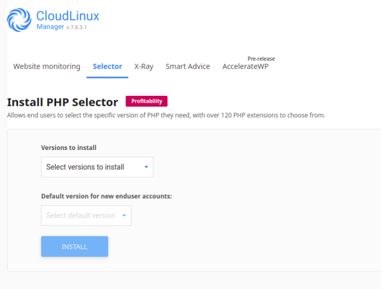

### PHP Handlers

#### Compatibility matrix

|**Web Server**|**PHP Selector**|
|:-:|:-:|
|Apache/suPHP|Yes|
|Apache/FCGID|Yes|
|Apache/CGI|Yes|
|Apache/mod_lsapi|Yes|

#### How to install Apache modules 

You can use cPanel interface:

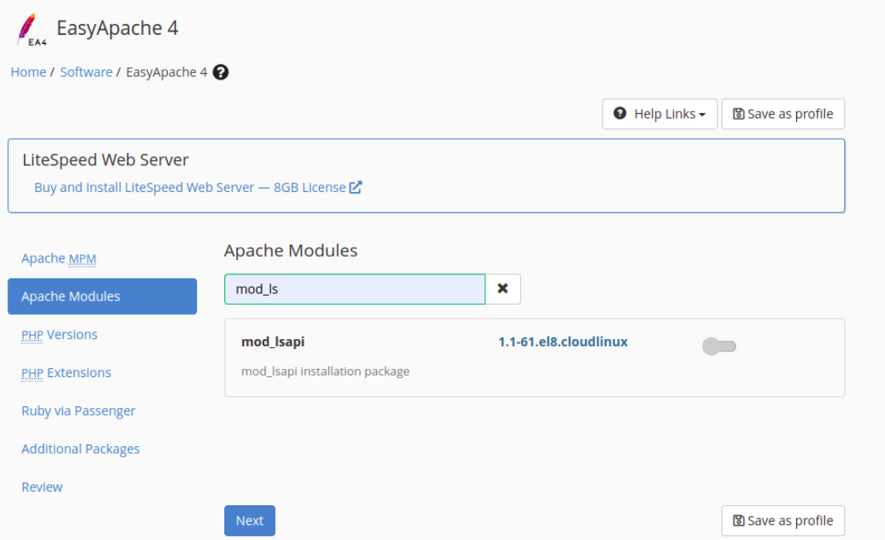

### Administrator interface

In the Selector tab the diagnostic bar help to monitor configuration of PHP Selector

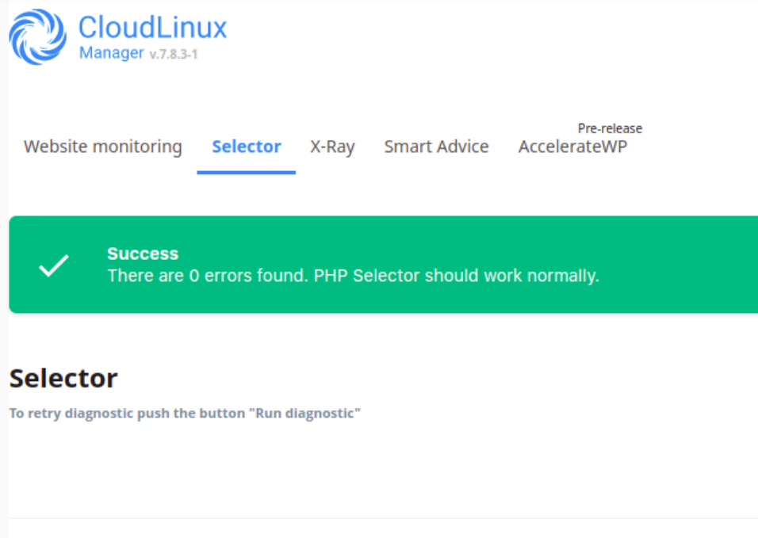

The Main Settings helps to monitor next settings

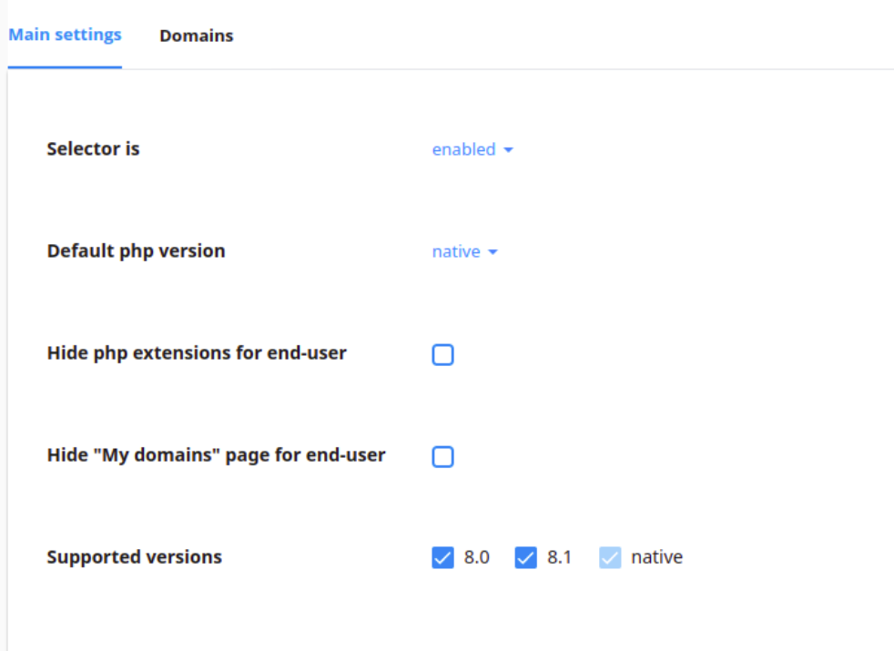

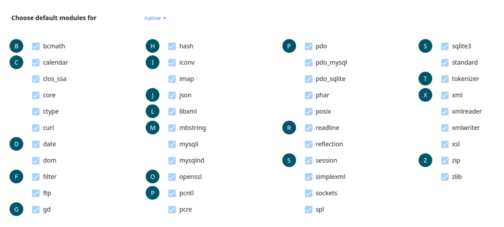
