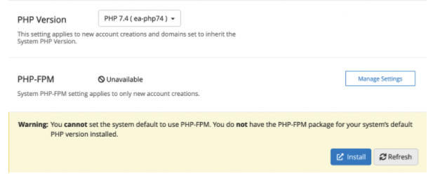
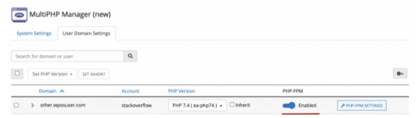

# FAQ

### What is the CloudLinux subsystem on Ubuntu?

CloudLinux subsystem on Ubuntu is a scope of deb-packages that allows using CloudLinux features on Ubuntu OS.
The main goal of this subsystem is to allow using the already existing CloudLinux functionality on another OS.

### How to install the CloudLinux subsystem on Ubuntu?

See [Installation](/sub-system-ubuntu/installation/).

### Is the CloudLinux subsystem on Ubuntu paid/unpaid?

During the beta period it is free.

### Can I get the ISO for the CloudLinux subsystem on Ubuntu?

As of now, only installation via `ubuntu2cloudlinux.py` is available.

### What control panel can be used with the CloudLinux subsystem on Ubuntu?

As of now, only cPanel is supported. Plesk and DirectAdmin are not supported.

### How can I get support for my CloudLinux subsystem on Ubuntu servers?

Feel free to contact Support via [Support Portal](https://www.cloudlinux.com/support-portal/).

### Can I use other CloudLinux products (Imunify360, KernelCare) with the CloudLinux subsystem on Ubuntu?

During the first beta release you cannot use other CloudLinux products (Imunify360, KernelCare) with the CloudLinux subsystem on Ubuntu.
We're planning to add them in the upcoming releases.

### Can I use Docker with the CloudLinux subsystem on Ubuntu?

You cannot use Docker with the CloudLinux subsystem on Ubuntu in the current version.

### Is control panel integration functionality available in the current release?

Yes, it is available.

### How to set up a PHP-fpm handler for the domain?

Since the PHP-fpm handler is required to use the WP Optimization Suite, you may need to configure it manually.

These are configuration steps:

1. Ensure the PHP-fpm package for the current PHP version is installed or install it.

    * Via MultiPHP Manager

   

2. Enable PHP-fpm handler for domain via MultiPHP Manager

   
